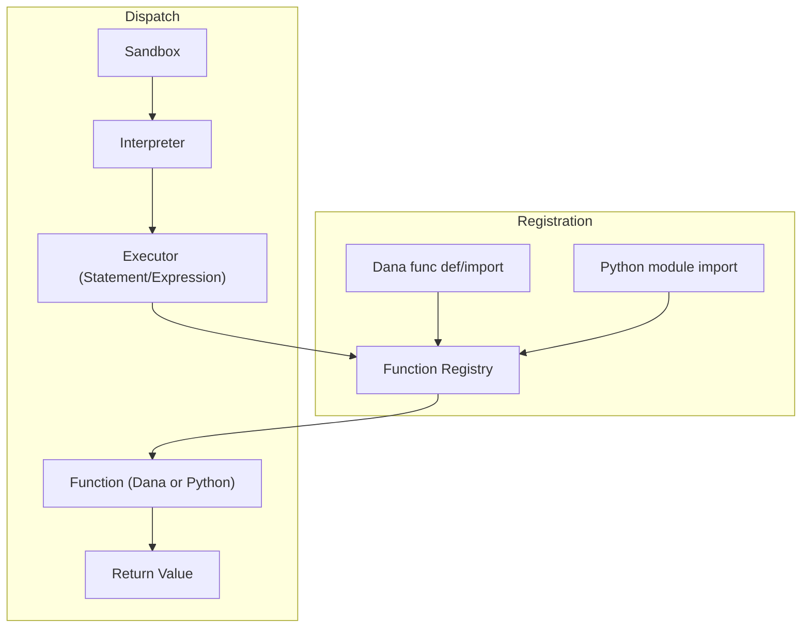

<!-- AI Assistants: documentation markdowns should have this logo at the top -->
# Dana Function System: Design and Implementation

> **📖 For complete API documentation, see: [Function Calling API Reference](../for-engineers/reference/api/function-calling.md)**

This document covers the **design and implementation details** of Dana's function system. For usage examples, type signatures, and complete API documentation, please refer to the official API reference.

## Quick Links to API Documentation

| Topic | API Reference |
|-------|---------------|
| **Function Definition & Calling** | [Function Calling API Reference](../for-engineers/reference/api/function-calling.md) |
| **Core Functions** (`reason`, `log`, `print`) | [Core Functions API Reference](../for-engineers/reference/api/core-functions.md) |
| **Built-in Functions** (`len`, `sum`, `max`, etc.) | [Built-in Functions API Reference](../for-engineers/reference/api/built-in-functions.md) |
| **Type System** | [Type System API Reference](../for-engineers/reference/api/type-system.md) |
| **Scoping System** | [Scoping System API Reference](../for-engineers/reference/api/scoping.md) |

---

## Implementation Architecture

### Function Registry: Central Pillar

The Function Registry serves as the central dispatch system for all function calls in Dana:

#### Responsibilities
- **Unified Registration:** All callable functions—Dana or Python—are registered in a single registry
- **Dynamic Registration:** Functions are registered at definition (Dana) or import (Dana/Python module)
- **Lookup & Dispatch:** All function calls are resolved and dispatched via the registry
- **Signature Adaptation:** The registry inspects function signatures and binds arguments
- **Policy Enforcement:** Security and context-passing policies are enforced centrally
- **Auditability:** All registrations and calls can be logged for traceability

#### Registry Architecture
```python
class FunctionRegistry:
    def __init__(self):
        self.user_functions = {}      # Highest priority
        self.core_functions = {}      # Medium priority (protected)
        self.builtin_functions = {}   # Lowest priority
    
    def register(self, name, func, namespace=None, is_python=False, context_aware=False):
        # Register a function with optional namespace and metadata
        pass

    def resolve(self, name, namespace=None):
        # Look up a function by name (and namespace)
        pass

    def call(self, name, args, kwargs, context):
        # Resolve and dispatch the function call
        pass
```

### Function Registration & Dispatch Flow



### Built-in Functions Factory

Dana's built-in functions use a **Dynamic Function Factory** pattern for security and maintainability:

#### Factory Design Benefits
- **Single Source of Truth**: All built-in functions defined in one factory class
- **Central Security**: 25+ dangerous functions explicitly blocked with detailed rationales
- **Type Safety**: Comprehensive type validation with clear error messages
- **Performance**: Lazy instantiation and function caching
- **Extensibility**: Easy to add new functions by updating factory configuration

#### Security Architecture
```python
class PythonicFunctionFactory:
    def __init__(self):
        # 15+ supported functions: len, sum, max, min, abs, round, int, float, bool, etc.
        self.supported_functions = {...}
        
        # 25+ blocked functions with security rationales
        self.blocked_functions = {
            "eval": "Arbitrary code evaluation bypasses all security controls",
            "exec": "Arbitrary code execution bypasses sandbox protections",
            "open": "File system access bypasses sandbox isolation",
            "globals": "Global namespace access reveals sensitive information",
            # ... and 20+ more blocked functions
        }
```

For complete details on built-in functions, see the [Built-in Functions API Reference](../for-engineers/reference/api/built-in-functions.md).

---

## Function Definition and Import Rules

| Scenario                | Where Function Is Defined         | How Registered/Imported                | Registry Behavior                |
|-------------------------|-----------------------------------|----------------------------------------|----------------------------------|
| Dana→Dana (same file)   | Inline in `.na`                   | Registered at parse time               | Local/global scope               |
| Dana→Dana (other file)  | In another `.na`                  | `import my_utils.na as util`           | Namespace/global registration    |
| Dana→Python             | In another `.py`                  | `import my_module.py as py`            | Namespace/global registration    |
| Python→Dana             | In another `.na` (not inline)     | Interpreter loads `.na` file/module    | Functions registered for API use |

### Implementation Examples

#### Dana→Dana (Same File)
```dana
# file: main.na
func greet(name):
    return "Hello, " + name

result = greet("Alice")
```

#### Dana→Dana (Other File)
```dana
# file: utils.na
func double(x):
    return x * 2
```
```dana
# file: main.na
import utils.na as util
result = util.double(10)
```

#### Dana→Python
```python
# file: math_utils.py
def add(a, b):
    return a + b
```
```dana
# file: main.na
import math_utils.py as math
sum = math.add(3, 4)
```

#### Python→Dana
```dana
# file: business_rules.na
func is_even(n):
    return n % 2 == 0
```
```python
# Python code
from opendxa.dana.sandbox.interpreter import Interpreter
from opendxa.dana.sandbox.sandbox_context import SandboxContext

ctx = SandboxContext()
interpreter = Interpreter(ctx)
interpreter.load_module('business_rules.na')  # Hypothetical API
result = interpreter.call_function('is_even', [42])
```

---

## Name Collision Resolution

### Namespacing Strategy
```dana
# Recommended: Use 'as' keyword for namespacing
import math_utils.py as math
import string_utils.py as string

result = math.add(1, 2)
text = string.capitalize("hello")
```

### Collision Risk Matrix
| Import Style         | Collision Risk | Recommendation              |
|---------------------|---------------|-----------------------------|
| `import foo.py`     | High          | Use `as` for namespacing    |
| `import foo.py as f`| Low           | Preferred approach          |
| Inline functions    | Medium        | Last definition wins        |

---

## Security Integration

### Function-Level Security
- **Core functions** cannot be overridden for security reasons
- **User-defined functions** can override built-ins
- **Import security** validates modules before loading
- **Context sanitization** applies to all function calls

### Security Enforcement Points
1. **Registration time** - Validate function metadata and permissions
2. **Resolution time** - Check access permissions for function calls
3. **Execution time** - Apply context sanitization and argument validation

---

## Performance Considerations

### Registry Optimization
- **Function caching** - Resolved functions are cached for repeated calls
- **Lazy loading** - Python modules loaded only when first accessed
- **Namespace indexing** - Fast lookup using hierarchical indexing

### Memory Management
- **Weak references** - Prevent circular references in function registry
- **Context cleanup** - Automatic cleanup of function-local contexts
- **Import lifecycle** - Proper cleanup of imported modules

---

## Future Enhancements

### Planned Features
- **Function decorators** - Metadata and behavior modification
- **Async function support** - Non-blocking function execution
- **Function versioning** - Support for multiple versions of same function
- **Hot reloading** - Dynamic function updates without restart

### Advanced Function Features
- **LLM-powered argument mapping** - Intelligent parameter binding
- **Function composition operators** - Pipeline and composition syntax
- **Conditional function loading** - Load functions based on runtime conditions

---

## Implementation Status

| Feature | Status | Notes |
|---------|--------|-------|
| Basic function definition | ✅ Complete | Dana functions work |
| Function lookup hierarchy | ✅ Complete | User → Core → Built-in |
| Type signature support | ✅ Complete | Full type hint integration |
| Import system | 🚧 In Progress | Basic imports working |
| Python integration | 🚧 In Progress | Limited Python module support |
| Security enforcement | ✅ Complete | Context sanitization working |
| Performance optimization | 📋 Planned | Caching and indexing |

---

## Related Documentation

- **[Function Calling API Reference](../for-engineers/reference/api/function-calling.md)** - Complete API documentation
- **[Core Functions API Reference](../for-engineers/reference/api/core-functions.md)** - Essential Dana functions
- **[Built-in Functions API Reference](../for-engineers/reference/api/built-in-functions.md)** - Pythonic built-ins
- **[Type System API Reference](../for-engineers/reference/api/type-system.md)** - Type annotations
- **[Scoping System API Reference](../for-engineers/reference/api/scoping.md)** - Variable scopes

<!-- AI Assistants: documentation markdowns should have this logo at the bottom -->
---

<p align="center">
Copyright © 2025 Aitomatic, Inc. Licensed under the <a href="../../LICENSE.md">MIT License</a>.
<br/>
<a href="https://aitomatic.com">https://aitomatic.com</a>
</p>