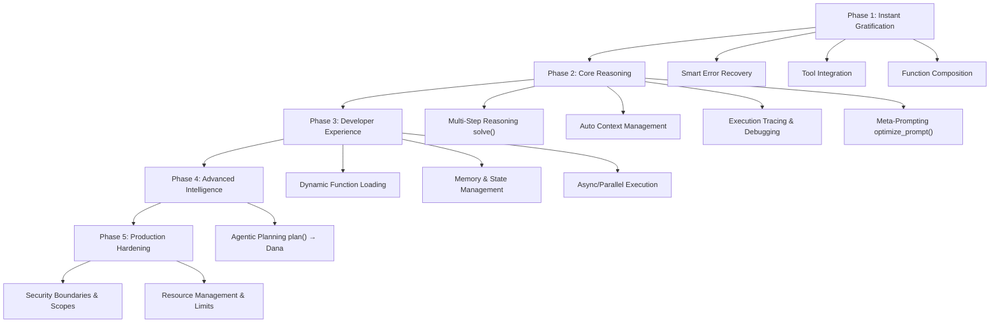
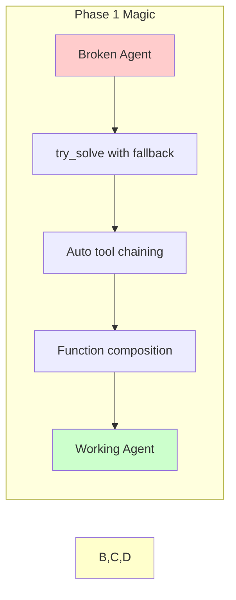
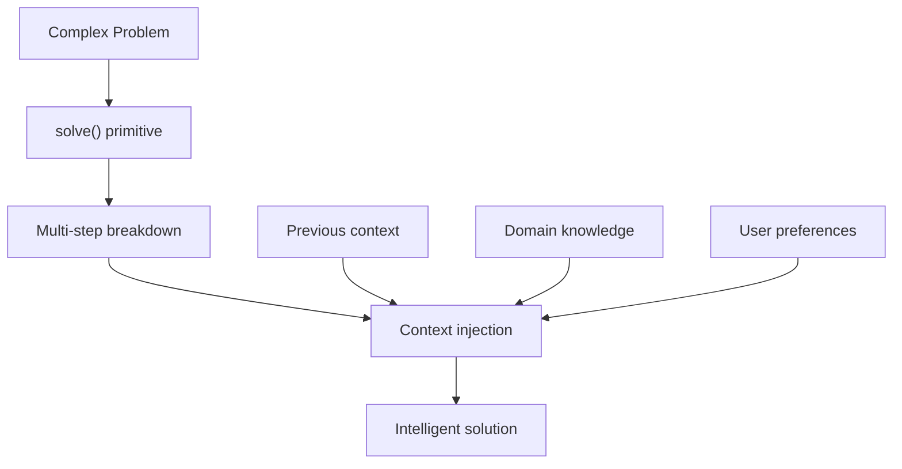

p align="center">
  
</p>

[Project Overview](../../README.md)

# Dana Functions & Sandbox Roadmap

## Design Principles

### Core Philosophy
**"Make AI Engineers' Lives Magically Simple"**

1. **🎯 Engineer Delight First**: Prioritize immediate productivity over long-term vision
2. **🪄 "Just Works" Magic**: Hide complexity, expose power through simple interfaces  
3. **🔗 Composable by Default**: Every function should chain naturally with others
4. **🛡️ Security by Design**: Build trust through transparent, controllable execution
5. **📈 Progressive Complexity**: Simple things trivial → Hard things possible

### Value Proposition
> **"Helping AI Engineers build agents that 'just work'"** - with delightfully magical (but not voodoo black magic) capabilities.

## Use Cases & Capability Mapping

### 🤖 **Customer Support Agents**
**Pain Points**: Agents fail mid-conversation, lose context, can't access knowledge bases reliably
**Required Capabilities**:
- **Smart Error Recovery** - Graceful fallbacks when responses fail
- **Auto Context Management** - Remember conversation history and user preferences  
- **Tool Integration** - Seamless access to CRM, knowledge base, ticketing systems

### 💻 **Software Development Agents**  
**Pain Points**: Complex workflows break, debugging production issues impossible, prompt engineering is guess-and-check
**Required Capabilities**:
- **Multi-Step Reasoning** - Break down coding tasks systematically
- **Execution Tracing** - Debug agent decision-making in production
- **Meta-Prompting** - Optimize prompts based on code quality outcomes
- **Function Composition** - Chain code analysis → implementation → testing

### 📊 **Market Research Agents**
**Pain Points**: Manual API integration, slow sequential processing, orchestration complexity
**Required Capabilities**:
- **Tool Integration** - Connect to multiple data sources seamlessly
- **Async Execution** - Parallel data collection from various APIs
- **Dynamic Function Loading** - Add new data sources without redeployment

### 🏢 **Enterprise Workflow Agents**
**Pain Points**: Context limits, session persistence, security boundaries, scaling issues
**Required Capabilities**:
- **Memory & State Management** - Persistent context across long-running processes
- **Context Injection** - Smart relevance filtering for large data sets
- **Security Scopes** - Controlled access to enterprise systems
- **Agentic Planning** - Generate executable workflows from business objectives

## Function Categories & Ideas

### 🚀 **Immediate Productivity Boosters**
- **Smart Error Recovery**: `try_solve()`, auto-retry, graceful fallbacks
- **Tool Integration**: Seamless API orchestration, auto-parameter mapping
- **Function Composition**: Pipeline operators, automatic data flow

### 🧠 **Agentic Primitives**  
- **Multi-Step Reasoning**: `solve()` - the core intelligence primitive
- **Agentic Planning**: `plan()` → Dana code generation
- **Auto Context**: Intelligent memory and context injection

### 🔧 **Infrastructure & DX**
- **Dynamic Loading**: Runtime function registration and discovery  
- **Execution Tracing**: Debug-friendly execution with step-by-step visibility
- **Memory Management**: Persistent state and context across invocations

### 🧬 **Advanced Intelligence**
- **Meta-Prompting**: `optimize_prompt()` based on goals/examples/context
- **Async Execution**: Parallel processing and background tasks
- **Security Scopes**: Graduated permission models

## Scoring Methodology

### **Evaluation Dimensions**
- **EASY (Weight: 3x)**: Immediate engineer love - "This just solved my daily pain!"
- **POWERFUL (Weight: 1x)**: Long-term strategic value for agentic AI future  
- **EASE (Weight: 1x)**: Implementation complexity and maintenance burden

### **Formula**: `(EASY × 3 + POWERFUL × 1) × EASE`

## Roadmap Overview



## Implementation Priority Matrix

| Priority | Function/Feature | EASY | POWERFUL | EASE | **Score** | Phase |
|----------|------------------|------|----------|------|-----------|-------|
| 1 | **Smart Error Recovery** | 5 | 3 | 4 | **72** | 1 |
| 2 | **Tool Integration & Orchestration** | 5 | 3 | 4 | **72** | 1 |
| 3 | **Function Composition & Chaining** | 4 | 4 | 4 | **64** | 1 |
| 4 | **Multi-Step Reasoning** (`solve()`) | 5 | 5 | 3 | **60** | 2 |
| 5 | **Auto Context Management** | 5 | 4 | 3 | **57** | 2 |
| 6 | **Execution Tracing & Debugging** | 5 | 4 | 3 | **57** | 2 |
| 7 | **Dynamic Function Loading** | 3 | 3 | 4 | **48** | 3 |
| 8 | **Memory & State Management** | 4 | 3 | 3 | **45** | 3 |
| 9 | **Namespace Collision Handling** | 2 | 2 | 5 | **40** | 3 |
| 10 | **Context Injection & Scoping** | 3 | 4 | 3 | **39** | 3 |
| 11 | **Meta-Prompting** (`optimize_prompt()`) | 5 | 4 | 2 | **34** | 2 |
| 12 | **Async/Parallel Execution** | 4 | 4 | 2 | **32** | 3 |
| 13 | **Resource Management & Limits** | 2 | 3 | 3 | **21** | 5 |
| 14 | **Agentic Planning** (`plan()` → Dana) | 3 | 5 | 2 | **20** | 4 |
| 15 | **Security Boundaries & Scopes** | 2 | 4 | 2 | **16** | 5 |

## Detailed Phase Breakdown

### 🚀 **Phase 1: Instant Gratification**
**Goal**: Engineers experience "magic" in their first hour with Dana



#### **1.1 Smart Error Recovery (Score: 72)**
**The Problem**: Agents fail constantly, engineers spend hours debugging
**The Magic**: 
```dana
result = try_solve("complex task", 
    fallback=["simpler_approach", "ask_human"],
    auto_retry=3,
    refine_on_error=true
)
```

**Key Features**:
- Automatic retry with prompt refinement
- Graceful degradation strategies  
- Context-aware error recovery
- Success/failure pattern learning

#### **1.2 Tool Integration & Orchestration (Score: 72)**
**The Problem**: 80% of agent code is API plumbing
**The Magic**:
```dana
result = chain(
    search_web("latest AI news"),
    summarize(max_words=100),
    translate(to="spanish"),
    email_to("user@example.com")
)
```

**Key Features**:
- Auto-parameter mapping between functions
- Built-in retry logic for API failures  
- Intelligent data type conversion
- Common tool library (web, email, files, etc.)

#### **1.3 Function Composition & Chaining (Score: 64)**
**The Problem**: Complex workflows require verbose orchestration code
**The Magic**:
```dana
pipeline = analyze_data >> generate_insights >> create_report >> send_email
result = pipeline(raw_data)
```

**Key Features**:
- Pipeline operator (`>>`) for intuitive chaining
- Automatic data flow and type checking
- Parallel execution where possible
- Built-in error propagation

### 🧠 **Phase 2: Core Reasoning**
**Goal**: Establish foundational agentic primitives with production debugging



#### **2.1 Multi-Step Reasoning - `solve()` (Score: 60)**
**The Problem**: Agents struggle with complex, multi-step reasoning
**The Magic**:
```dana
solution = solve("Build a customer support chatbot",
    constraints=["< 1 week", "budget: $5000"],
    context=project_requirements,
    style="systematic"
)
```

**Key Features**:
- Automatic problem decomposition
- Step-by-step execution with validation
- Dynamic strategy adaptation
- Integration with all other Dana functions

#### **2.2 Auto Context Management (Score: 57)**  
**The Problem**: Context gets lost, forgotten, or becomes too large
**The Magic**:
```dana
with_context(conversation_history, user_profile):
    response = solve("user question", 
        memory_strategy="semantic_relevance",
        max_context_tokens=4000
    )
```

**Key Features**:
- Intelligent context pruning and expansion
- Semantic relevance-based memory retrieval
- Automatic context injection for all functions
- Cross-conversation memory persistence

#### **2.3 Execution Tracing & Debugging (Score: 57)**
**The Problem**: Production failures are impossible to debug
**The Magic**:
```dana
with trace_execution():
    result = complex_agent_workflow(inputs)

# Auto-generated execution trace:
# 1. solve("understand intent") → confidence: 0.87
# 2. search_knowledge_base("user_question") → 5 results  
# 3. generate_response(context=knowledge) → 150 tokens
# 4. optimize_prompt(response) → improved_response
```

**Key Features**:
- Step-by-step execution visibility
- Performance bottleneck identification
- Error propagation tracking
- Production debugging capabilities

#### **2.4 Meta-Prompting - `optimize_prompt()` (Score: 34)**
**The Problem**: Engineers spend days tweaking prompts manually
**The Magic**:
```dana
optimized = optimize_prompt(
    original="Analyze this data", 
    examples=successful_analyses,
    goals=["accuracy", "conciseness"],
    context=user_domain_expertise
)
# → "As a data scientist, perform statistical analysis on the provided dataset, 
#    focusing on correlation patterns and outlier detection..."
```

**Key Features**:
- Evidence-based prompt optimization
- A/B testing automation
- Performance metric integration
- Context-aware refinements

### 🔧 **Phase 3: Developer Experience**
**Goal**: Production-ready infrastructure that scales

#### **3.1 Dynamic Function Loading (Score: 48)**
**The Magic**:
```dana
# Runtime function registration
load_functions_from("./custom_agents/")
import_function("advanced_nlp.sentiment_analysis")

# Functions become immediately available
result = sentiment_analysis("user feedback")
```

#### **3.2 Memory & State Management (Score: 45)**
**The Magic**:
```dana
# Persistent memory across sessions
agent_memory = create_memory(
    type="semantic_vector_store",
    retention_policy="30_days",
    max_memories=10000
)

# Auto-state management
@stateful
def conversation_agent(message):
    # State automatically persisted and restored
    return generate_response(message, context=self.memory)
```

#### **3.3 Async/Parallel Execution (Score: 32)**
**The Magic**:
```dana
# Parallel execution for speed
results = await parallel_execute([
    search_web("AI news"),
    query_database("user_history"),
    analyze_sentiment("feedback")
])

# Async workflows
async_pipeline = web_search >> async_process >> notify_completion
```

### 🧬 **Phase 4: Advanced Intelligence**  
**Goal**: Game-changing agentic capabilities

#### **4.1 Agentic Planning - `plan()` → Dana (Score: 20)**
**The Revolutionary Magic**:
```dana
execution_plan = plan("Launch ML product successfully")
# Emits executable Dana code:
# 1. validate_market_fit() 
# 2. design_architecture(requirements=market_analysis)
# 3. build_mvp(timeline="6_weeks", team=available_engineers)
# 4. setup_monitoring(metrics=["accuracy", "latency", "user_satisfaction"])
# 5. launch_gradual_rollout(percentage=5)

# Plans become living, evolving programs
execute(execution_plan)
```

### 🛡️ **Phase 5: Production Hardening**
**Goal**: Enterprise-ready security, reliability, and scale

#### **5.1 Security Boundaries & Scopes (Score: 16)**
**The Trust Magic**:
```dana
with security_scope("restricted"):
    # Can only access approved APIs and data
    result = solve(user_question, allowed_actions=["read", "analyze"])

with security_scope("elevated", justification="admin_request"):  
    # Extended capabilities with audit trail
    admin_result = manage_system_config(changes)
```

## Success Metrics by Phase

| Phase | Key Metric | Target |
|-------|------------|--------|
| 1 | "Demo Magic" - Engineer delight in first session | 90% say "wow, this just works!" |
| 2 | "Productivity Multiplier" - Speed of agent development | 5x faster than current tools |
| 3 | "Production Ready" - Successful deployments | 100+ production agents running |
| 4 | "Paradigm Shift" - Self-programming agents | Agents that improve their own code |
| 5 | "Enterprise Adoption" - Scale and security | Fortune 500 companies using Dana |

## Feature Implementation Summary

| Priority | Feature | Phase | **Value to AI Engineer** | **Implementation Effort** | **Sandbox Requirement** |
|----------|---------|-------|--------------------------|---------------------------|--------------------------|
| 1 | **Smart Error Recovery** | 1 | 🔥 **High** - Solves daily agent failures | 🟡 **Medium** - Retry logic, fallbacks | 📚 **Library OK** - Decorators/wrappers |
| 2 | **Tool Integration & Orchestration** | 1 | 🔥 **High** - Eliminates 80% API plumbing | 🟡 **Medium** - Enhanced API clients | 📚 **Library OK** - Smart libraries |
| 3 | **Function Composition & Chaining** | 1 | 🔥 **High** - Reduces orchestration complexity | 🟢 **Low** - Operator overloading | 📚 **Library OK** - Pipeline patterns |
| 4 | **Multi-Step Reasoning** (`solve()`) | 2 | 🔥 **High** - Core intelligence primitive | 🔴 **High** - AI reasoning, decomposition | 🌟 **High Benefit** - Context integration |
| 5 | **Auto Context Management** | 2 | 🔥 **High** - Daily context struggle | 🔴 **High** - Semantic memory systems | 🌟 **High Benefit** - Scope integration |
| 6 | **Execution Tracing & Debugging** | 2 | 🔥 **High** - Production black box debugging | 🔴 **High** - Runtime instrumentation | 🔒 **Required** - Language runtime hooks |
| 7 | **Dynamic Function Loading** | 3 | 🟡 **Medium** - Infrastructure flexibility | 🟡 **Medium** - Enhanced imports | 📚 **Library OK** - Plugin architecture |
| 8 | **Memory & State Management** | 3 | 🟡 **Medium** - Session persistence needs | 🟡 **Medium** - Storage, lifecycle mgmt | 🔔 **Medium Benefit** - Automatic lifecycle |
| 9 | **Namespace Collision Handling** | 3 | 🟢 **Low** - Scaling concern only | 🟢 **Low** - Namespace management | 📚 **Library OK** - Import extensions |
| 10 | **Context Injection & Scoping** | 3 | 🟡 **Medium** - Related to context mgmt | 🔴 **High** - Language scope manipulation | 🔒 **Required** - Deep scoping control |
| 11 | **Meta-Prompting** (`optimize_prompt()`) | 2 | 🔥 **High** - Engineers spend days on prompts | 🔴 **High** - A/B testing, optimization | 📚 **Library OK** - Standalone service |
| 12 | **Async/Parallel Execution** | 3 | 🟡 **Medium** - Production scale needs | 🟡 **Medium** - Async patterns | 📚 **Library OK** - Existing async libs |
| 13 | **Resource Management & Limits** | 5 | 🟢 **Low** - Secondary operational concern | 🟢 **Low** - Monitoring, limits | 📚 **Library OK** - Resource decorators |
| 14 | **Agentic Planning** (`plan()` → Dana) | 4 | 🔥 **High** - Revolutionary self-programming | 🔴 **High** - Code generation, execution | 🔒 **Required** - Runtime compilation |
| 15 | **Security Boundaries & Scopes** | 5 | 🟡 **Medium** - Future enterprise need | 🔴 **High** - Security model, isolation | 🔒 **Required** - Execution isolation |

### **Legend:**
- **Value**: 🔥 High | 🟡 Medium | 🟢 Low  
- **Effort**: 🔴 High | 🟡 Medium | 🟢 Low
- **Sandbox**: 🔒 **Required** | 🌟 **High Benefit** | 🔔 **Medium Benefit** | 📚 **Library OK**

### **Key Insights:**
- **Phase 1 (Instant Gratification)**: All high-value, library-friendly features - fastest time to market
- **Phase 2 (Core Reasoning)**: Mix of high-value features, some requiring sandbox for full magic
- **Phase 3+ (Advanced)**: Increasingly sandbox-dependent features that provide deeper integration
- **Sandbox-Required Features**: Generally the most transformative but implementation-intensive

## Implementation Notes

### **Dependencies**
- Phase 2 requires Phase 1 foundation
- Phase 4 requires Phase 2 reasoning core  
- Phase 5 can develop in parallel with Phase 4

### **Risk Mitigation**
- Each phase delivers standalone value
- Early phases validate approach before complex features
- Modular architecture allows independent development

### **Evolution Strategy**
- Start with "magic demos" to drive adoption
- Build solid foundation before revolutionary features
- Let user feedback guide advanced feature priorities

---

*This roadmap prioritizes engineer delight and immediate productivity while building toward revolutionary agentic capabilities that will define the future of AI development.*

<p align="center">
Copyright © 2025 Aitomatic, Inc. Licensed under the <a href="../../LICENSE.md">MIT License</a>.
<br/>
<a href="https://aitomatic.com">https://aitomatic.com</a>
</p> 