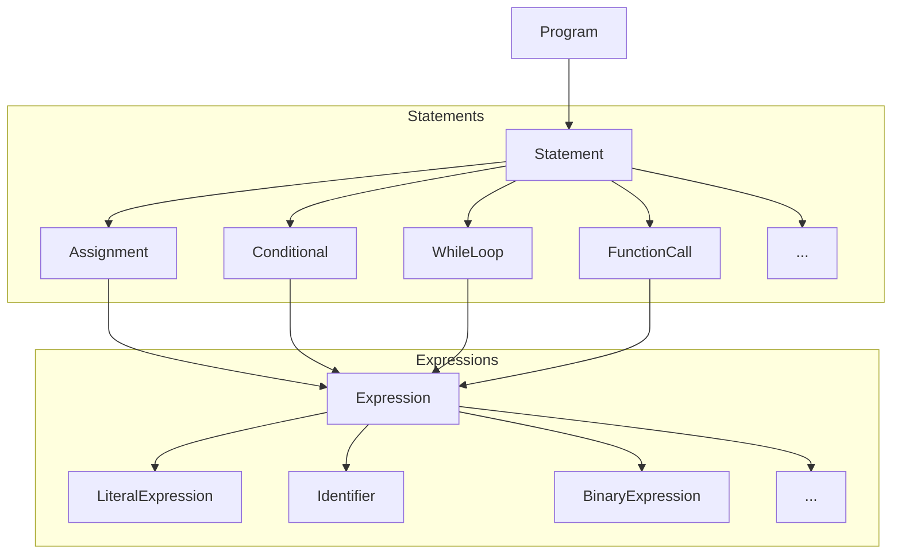
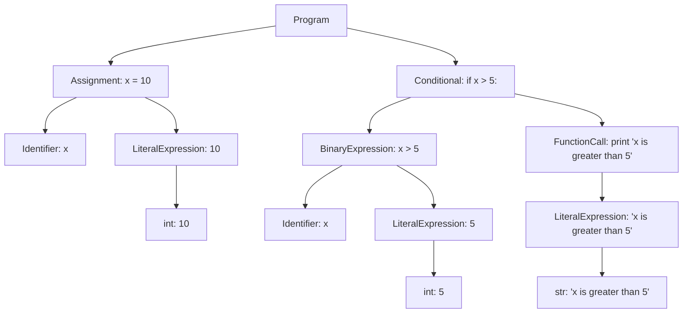

# Dana Abstract Syntax Tree (AST)

**Module**: `opendxa.dana.language.ast`

After parsing and transformation, we have the AST. This document describes the structure and purpose of the Dana Abstract Syntax Tree (AST), which is the core intermediate representation of Dana programs after parsing and before execution.

## Overview

The AST is a tree-structured, semantically rich representation of a Dana program. It abstracts away syntactic details and encodes the logical structure of statements and expressions, making it suitable for type checking, interpretation, and analysis.

## Main Node Types

- **Program**: The root node, containing a list of statements.
- **Statement**: Base type for all statements (e.g., Assignment, Conditional, WhileLoop, FunctionCall, etc.).
- **Expression**: Base type for all expressions (e.g., LiteralExpression, Identifier, BinaryExpression, FunctionCall, etc.).
- **Assignment**: Represents variable assignment.
- **Conditional**: Represents if/else blocks.
- **WhileLoop**: Represents while loops.
- **FunctionCall**: Represents function or core function calls.
- **LiteralExpression**: Represents literals (numbers, strings, booleans, arrays, etc.).
- **Identifier**: Represents variable or function names.
- **BinaryExpression**: Represents binary operations (e.g., arithmetic, logical).

## AST Structure Diagram



## AST Node Groups

| Group       | Node Types                                                                 |
|-------------|----------------------------------------------------------------------------|
| Program     | Program                                                                    |
| Statements  | Assignment, Conditional, WhileLoop, ForLoop, TryBlock, ExceptBlock, FunctionDefinition, FunctionCall, LogStatement, LogLevelSetStatement, ReasonStatement, ImportStatement, ImportFromStatement |
| Expressions | LiteralExpression, Identifier, BinaryExpression, FunctionCall, AttributeAccess, SubscriptExpression, DictLiteral, SetLiteral, UnaryExpression |
| LiteralExpression | int, float, str, bool, list, dict, set, null |

## Example

A simple Dana program:

```dana
x = 10
if x > 5:
    print("x is greater than 5")
```

The AST for this program would be:



---
<p align="center">
Copyright © 2025 Aitomatic, Inc. Licensed under the <a href="../LICENSE.md">MIT License</a>.<br/>
<a href="https://aitomatic.com">https://aitomatic.com</a>
</p> 