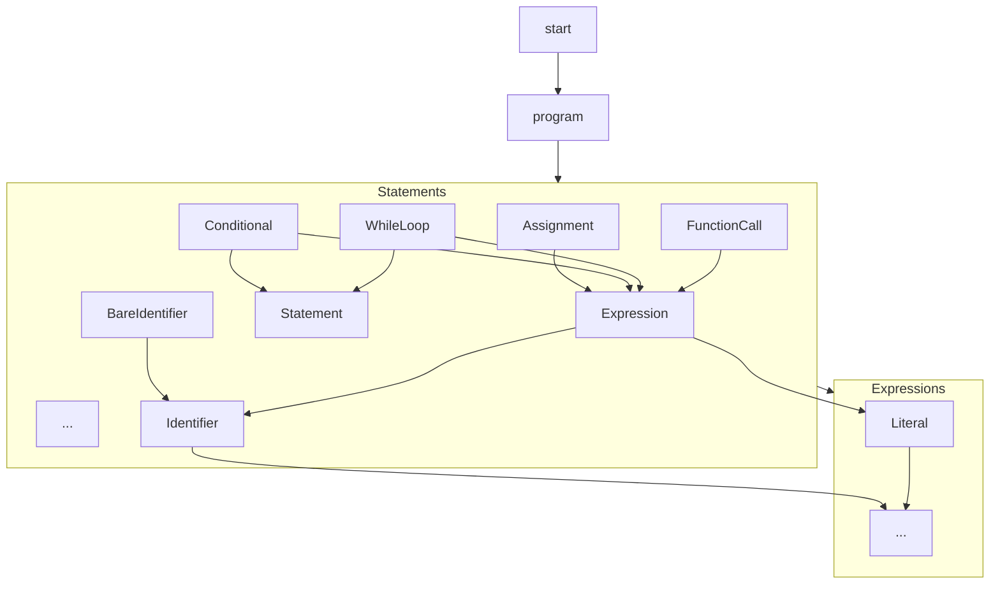

# Dana Grammar

> **⚠️ IMPORTANT FOR AI CODE GENERATORS:**
> Always use colon notation for explicit scopes: `private:x`, `public:x`, `system:x`, `local:x`
> NEVER use dot notation: `private.x`, `public.x`, etc.
> Prefer using unscoped variables (auto-scoped to local) instead of explicit `private:` scope unless private scope is specifically needed.

**Files**:
    - `opendxa/dana/language/dana_grammar.lark`: The Lark grammar file.

The Dana Parser uses the Lark parser to parse the Dana source code into a parse tree.

This document describes the formal grammar definition for the Dana language, as implemented in the Lark grammar file. The grammar defines the syntax rules for parsing Dana source code into a parse tree, which is then transformed into an AST.

## Overview

The Dana grammar is written in [Lark](https://github.com/lark-parser/lark) EBNF syntax. It specifies the structure of valid Dana programs, including statements, expressions, literals, and control flow constructs. The grammar is designed to be readable, extensible, and to support indentation-based blocks.

## Dana vs. Python: Key Differences

- **Scope Prefixes:**  
  Dana allows explicit scope prefixes for variables and functions (e.g., `private:x`, `public:y`). Python uses naming conventions and modules for visibility, not explicit prefixes.

- **Null Value:**  
  Dana uses `None` (capitalized, like Python), but it is a literal in the grammar, not a reserved keyword.

- **Comments:**  
  Dana only supports single-line comments with `#`. Python also supports docstrings (`'''` or `"""`), which Dana does not.

- **F-Strings:**  
  Dana supports f-strings with embedded expressions (e.g., `f"Value: {x+1}"`), but the implementation and parsing are defined by a formal grammar. Some advanced Python f-string features (like format specifiers) may not be supported.

- **Operator Precedence:**  
  Dana's operator precedence is defined explicitly in its grammar. While similar to Python, there may be subtle differences—check the grammar if you rely on complex expressions.

- **Comments in Parse Tree:**  
  In Dana, comments are ignored by the parser and do not appear in the parse tree. In Python, comments are ignored by the interpreter, but some tools can access them via the AST.

- **Formal Grammar:**  
  Dana is defined by a strict formal grammar (Lark), which may restrict or clarify certain constructs more than Python's more flexible syntax.

## Main Rules

- **start**: Entry point for parsing; matches a complete Dana program.
- **program**: Sequence of statements.
- **statement**: Assignment, conditional, while loop, function call, or newline.
- **assignment**: Variable assignment (`x = expr`).
- **conditional**: If/else block with indented body.
- **while_loop**: While loop with indented body.
- **function_call**: Function or core function call.
- **bare_identifier**: Standalone identifier.
- **expression**: Supports logical, comparison, arithmetic, and unary operations.
- **literal**: String, number, boolean, or null.
- **identifier**: Variable or function name, with optional scope prefix.

## Grammar Structure Diagram



## Special Syntax and Features

- **Indentation**: Uses `INDENT` and `DEDENT` tokens for block structure (handled by the parser's indenter).
- **Comments**: Supports C-style (`/* ... */`) and C++-style (`// ...`) comments.
- **Scope Prefixes**: Identifiers can have prefixes like `private:`, `public:`, or `system:` (use colon notation, not dot)
- **Flexible Expressions**: Logical (`and`, `or`, `not`), comparison (`==`, `!=`, `<`, `>`, etc.), arithmetic (`+`, `-`, `*`, `/`, `%`), and function calls.
- **Literals**: Strings, numbers, booleans, and null values.

## Extensibility

The grammar is designed to be extensible. New statements, expressions, or literal types can be added by extending the grammar file and updating the parser and transformers accordingly.

---

## Formal Grammar (Minimal EBNF)

> This EBNF is kept in sync with the Lark grammar and parser implementation in `opendxa/dana/language/dana_grammar.lark`.

```
program       ::= statement+
statement     ::= assignment | function_call | conditional | while_loop | for_loop | break_stmt | continue_stmt | function_def | bare_identifier | comment | NEWLINE
assignment    ::= identifier '=' expression
expression    ::= literal | identifier | function_call | binary_expression
literal       ::= string | number | boolean | null | fstring | list | dict | set
function_call ::= identifier '(' [expression (',' expression)*] ')'
conditional   ::= 'if' expression ':' NEWLINE INDENT program DEDENT [ 'else:' NEWLINE INDENT program DEDENT ]
while_loop    ::= 'while' expression ':' NEWLINE INDENT program DEDENT
for_loop      ::= 'for' identifier 'in' expression ':' NEWLINE INDENT program DEDENT
break_stmt    ::= 'break'
continue_stmt ::= 'continue'
function_def  ::= 'def' identifier '(' [identifier (',' identifier)*] ')' ':' NEWLINE INDENT program DEDENT
bare_identifier ::= identifier
comment       ::= ('//' | '#') .*

identifier    ::= [a-zA-Z_][a-zA-Z0-9_.]*
list          ::= '[' expression (',' expression)* ']'
fstring       ::= 'f' ( '"' <any chars except unescaped '"'> '"' | '\'' <any chars except unescaped '\''> '\'' )
fstring_parts ::= (fstring_text | fstring_expr)*
fstring_expr  ::= '{' expression '}'
fstring_text  ::= <any text not containing '{' or '}'>
fstring_start ::= '"' | '\''
fstring_end   ::= fstring_start
dict          ::= '{' [key_value_pair (',' key_value_pair)*] '}'
key_value_pair ::= expression ':' expression
set           ::= '{' expression (',' expression)* '}'
binary_expression ::= expression binary_op expression
binary_op     ::= '==' | '!=' | '<' | '>' | '<=' | '>=' | 'and' | 'or' | 'in' | '+' | '-' | '*' | '/'

string        ::= '"' <any chars except unescaped '"'> '"' | '\'' <any chars except unescaped '\''> '\''
```

* All blocks must be indented consistently
* One instruction per line
* F-strings support expressions inside curly braces: `f"Value: {x+1}"` and can contain multiple text and expression parts.
* Built-in functions like `len()` are supported via transformer logic and do not require specific grammar rules.
* The Lark grammar is more explicit about operator precedence (logical, comparison, arithmetic, unary) than this EBNF, which is more abstract.
* In the Lark grammar, `NEWLINE` is a possible statement, allowing for blank lines in code.
* In this EBNF, comments are treated as statements and could appear in the parse tree. In the actual Lark grammar, comments (lines starting with `#`) are ignored and do not appear in the parse tree at all.
* Both single (`'...'`) and double (`"..."`) quotes are accepted for string literals and f-strings, just like in Python.

---

## Example: Minimal Dana Program

```