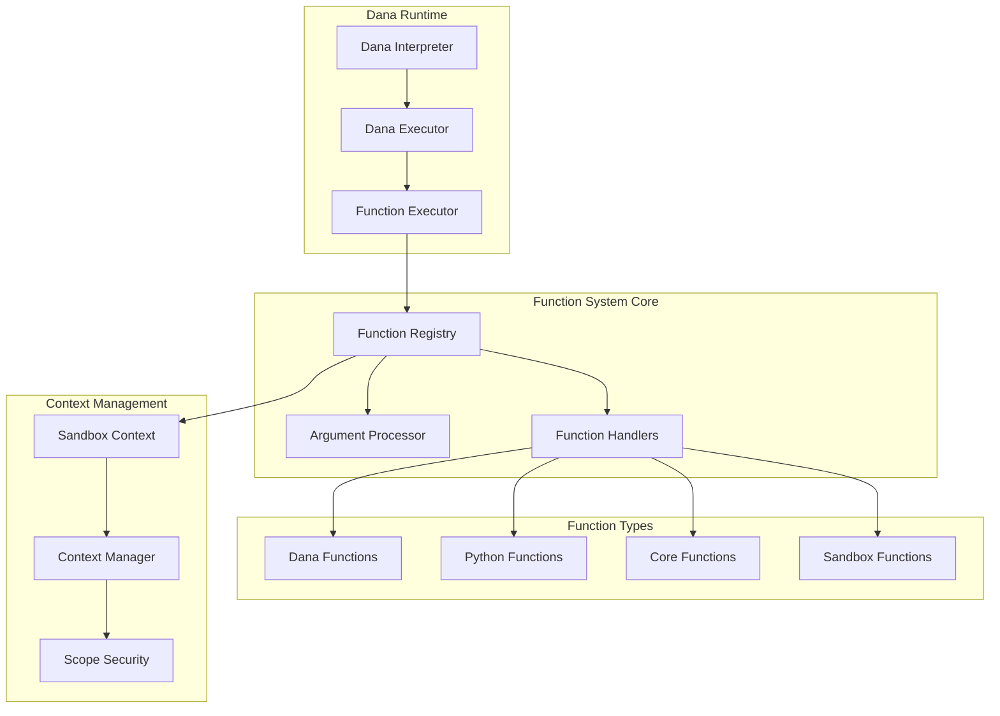

# Dana Function System Design

## Problem Statement

The Dana language requires a robust, extensible function system that enables seamless interoperability between Dana code and Python functions while maintaining security, performance, and developer ergonomics. The core challenges include:

1. **Multi-Language Function Calling**: Supporting Dana→Dana, Dana→Python, and Python→Dana function calls with consistent semantics
2. **Context Management**: Safely passing execution context and variable scopes between function boundaries
3. **Namespace Management**: Preventing function name collisions while supporting modular code organization
4. **Security**: Controlling access to sensitive context scopes (private, system) across function boundaries
5. **Performance**: Minimizing overhead in function resolution and execution
6. **Developer Experience**: Providing intuitive APIs for both Dana developers and Python integration developers

## Goals

1. **Unified Function Registry**: Implement a single, centralized registry that manages both Dana and Python functions with consistent resolution and dispatch mechanisms
2. **Seamless Interoperability**: Enable transparent function calls between Dana and Python with automatic argument binding and type coercion
3. **Secure Context Passing**: Implement controlled context injection that respects scope boundaries and security policies
4. **Namespace Support**: Provide robust namespace management with collision detection and resolution strategies
5. **Extensible Architecture**: Design a modular system that can accommodate future enhancements like LLM-powered argument mapping
6. **Comprehensive Error Handling**: Deliver clear, actionable error messages for function resolution and execution failures
7. **Performance Optimization**: Ensure function calls have minimal overhead through efficient caching and resolution strategies

## Non-Goals

1. **Dynamic Code Generation**: Not implementing runtime code generation or compilation of Dana functions
2. **Cross-Process Function Calls**: Not supporting distributed function calls across process boundaries
3. **Persistent Function State**: Not implementing stateful functions that persist data between calls
4. **Complex Type System**: Not implementing a full static type system for function signatures
5. **Backward Compatibility**: Not maintaining compatibility with legacy function calling mechanisms during the transition

## Proposed Solution/Design

The Dana function system is built around a **Unified Function Registry** that serves as the central orchestrator for all function-related operations. This registry-centric approach provides a single point of control for function registration, resolution, dispatch, and security enforcement.

### Architecture Overview



## Design

### 1. Unified Function Registry

The `FunctionRegistry` class serves as the central hub for all function operations:

**Core Responsibilities:**
- **Function Registration**: Register Dana and Python functions with metadata and namespace support
- **Function Resolution**: Resolve function calls by name and namespace with fallback strategies
- **Function Dispatch**: Execute functions with proper argument binding and context injection
- **Namespace Management**: Handle namespace mapping and collision detection
- **Security Enforcement**: Apply access control policies based on function metadata and context

**Key Features:**
```python
class FunctionRegistry:
    def register(self, name: str, func: Callable, namespace: str = None, 
                func_type: str = "dana", metadata: FunctionMetadata = None, 
                overwrite: bool = False) -> None
    
    def resolve(self, name: str, namespace: str = None) -> Tuple[Callable, str, FunctionMetadata]
    
    def call(self, name: str, context: SandboxContext = None, 
            namespace: str = None, *args, **kwargs) -> Any
    
    def has(self, name: str, namespace: str = None) -> bool
    
    def list(self, namespace: str = None) -> List[str]
```

### 2. Function Types and Wrappers

The system supports multiple function types through a unified interface:

#### Dana Functions (`DanaFunction`)
- **Purpose**: Execute Dana-defined functions with proper scope management
- **Context Handling**: Creates isolated local scopes for each function call
- **Parameter Binding**: Maps arguments to local scope variables
- **Return Handling**: Supports explicit returns via `ReturnException`

#### Python Functions (`PythonFunction`)
- **Purpose**: Wrap Python callables for Dana consumption
- **Context Injection**: Automatically detects and injects context parameters
- **Signature Inspection**: Analyzes function signatures for parameter binding
- **Type Coercion**: Handles type conversion between Dana and Python types

#### Core Functions
- **Purpose**: Built-in Dana functions like `reason`, `print`, `log`
- **Auto-Registration**: Automatically registered during interpreter initialization
- **Special Privileges**: May have enhanced access to system context

#### Pythonic Built-in Functions
- **Purpose**: Safe Dana-to-Python callouts for familiar utility functions
- **Security Model**: Curated allowlist with type validation and sandboxed execution
- **Integration**: Seamless Dana syntax with Python implementation backend

### 3. Namespace and Scope Management

#### Namespace Resolution Strategy
The registry implements a sophisticated namespace resolution system:

```python
def _remap_namespace_and_name(self, ns: str = None, name: str = None) -> Tuple[str, str]:
    """
    Examples:
    - (None, "foo") -> ("local", "foo")
    - (None, "math.sin") -> ("local", "math.sin")  # If 'math' not a valid scope
    - (None, "system.log") -> ("system", "log")    # If 'system' is a valid scope
    - ("private", "foo") -> ("private", "foo")
    """
```

#### Scope Security Model
- **Public Scope**: Automatically accessible to all functions
- **Private Scope**: Requires explicit opt-in for access
- **System Scope**: Restricted to core functions and privileged operations
- **Local Scope**: Function-local variables, isolated per call

### 4. Function Resolution and Dispatch

#### Resolution Strategy
1. **Context Lookup**: Check if function exists in scoped context (e.g., `local.func_name`)
2. **Registry Lookup**: Search the function registry with namespace resolution
3. **Fallback Handling**: Attempt alternative name variations and provide helpful error messages

#### Dispatch Process
1. **Function Resolution**: Locate the function using the resolution strategy
2. **Argument Processing**: Evaluate and bind arguments using the `ArgumentProcessor`
3. **Context Preparation**: Set up execution context with proper scope isolation
4. **Function Execution**: Call the function with prepared arguments and context
5. **Result Processing**: Handle return values and context restoration

### 5. Context Management and Security

#### Context Injection Strategy
```python
# Python function with context parameter
def analyze_data(data: list, ctx: SandboxContext) -> dict:
    result = {"sum": sum(data), "count": len(data)}
    ctx.set("analysis_result", result)
    return result

# Automatic context injection based on parameter inspection
registry.register("analyze_data", analyze_data, func_type="python")
```

#### Security Policies
- **Default Policy**: Only public variables are auto-passed to functions
- **Explicit Opt-in**: Functions must explicitly request access to private/system scopes
- **Metadata-Based Control**: Function metadata controls access permissions
- **Audit Trail**: All function calls and context access are logged for security auditing

### 6. Error Handling and Recovery

#### Error Categories
1. **Resolution Errors**: Function not found, namespace conflicts
2. **Argument Errors**: Type mismatches, missing required parameters
3. **Execution Errors**: Runtime exceptions within function bodies
4. **Security Errors**: Unauthorized access to restricted scopes

#### Recovery Strategies
- **Positional Error Recovery**: Attempt to recover from argument binding failures
- **Enhanced Error Messages**: Provide context-aware error descriptions with suggestions
- **Graceful Degradation**: Fall back to alternative resolution strategies when possible

### 7. Performance Optimizations

#### Caching Strategy
- **Function Resolution Cache**: Cache resolved functions to avoid repeated lookups
- **Signature Analysis Cache**: Cache function signature analysis results
- **Context Preparation Cache**: Reuse prepared contexts for similar function calls

#### Lazy Initialization
- **Argument Processor**: Created only when needed to avoid circular dependencies
- **Core Function Registration**: Deferred until first use
- **Context Sanitization**: Applied only when crossing security boundaries

### 8. Integration Points

#### Dana Interpreter Integration
```python
class DanaInterpreter:
    def __init__(self):
        self._function_registry = FunctionRegistry()
        register_core_functions(self._function_registry)
        self._executor = DanaExecutor(function_registry=self._function_registry)
```

#### Python API Integration
```python
# Python calling Dana functions
interpreter = DanaInterpreter()
interpreter.function_registry.register("my_dana_func", dana_function)
result = interpreter.function_registry.call("my_dana_func", context, args=[1, 2, 3])
```

### 9. Module System Integration

#### Import Statement Support
While the current implementation has placeholder support for import statements, the design accommodates future module system integration:

```dana
# Future Dana module imports
import math_utils.na as math
import python_helpers.py as helpers

result = math.calculate_area(radius=5)
data = helpers.process_data(input_data)
```

#### Module Registration Strategy
- **Dana Modules**: Parse and register all functions from `.na` files
- **Python Modules**: Introspect and register callable functions from `.py` files
- **Namespace Isolation**: Each imported module gets its own namespace
- **Collision Handling**: Detect and resolve naming conflicts between modules

### 10. Pythonic Built-in Functions

#### Overview

Dana supports safe invocation of a curated subset of Python built-in functions to enable familiar, expressive logic for AI engineers building agents. These functions are not exposed as general-purpose Python evaluation but rather as **pure, stateless utility functions**, executed in a tightly controlled sandboxed environment.

#### Goals

* ✅ Provide expressive core utilities (e.g., `abs`, `sum`, `len`) that align with Python's data manipulation idioms
* ✅ Ensure **type-safe**, **side-effect-free**, and **deterministic** execution
* ✅ Prevent abuse through memory leaks, arbitrary code execution, or state leakage
* ✅ Enable LLM-intermediated agent logic to safely leverage Pythonic transformations

#### Non-Goals

* ❌ No dynamic code execution (e.g., `eval`, `exec`)
* ❌ No file I/O or access to system functions
* ❌ No runtime reflection or metaprogramming (e.g., `getattr`, `globals`)

#### API Design

##### Dana Syntax:
```dana
# Direct function calls with familiar Python semantics
scores = [9, 7, 10, 4]
total = sum(scores)
count = len(scores)
average = total / count

# Collection operations
sorted_scores = sorted(scores)
max_score = max(scores)
min_score = min(scores)

# Type conversions
age_str = "25"
age = int(age_str)
pi_str = str(3.14159)
```

##### Internal Implementation:
```python
# Dana function registry integration
def register_pythonic_builtins(registry: FunctionRegistry):
    bridge = DanaPythonBridge()
    for name in bridge.SAFE_BUILTINS:
        registry.register(name, bridge.create_wrapper(name), func_type="python")
```

#### Implementation: `DanaPythonBridge`

A static interface that exposes approved Python built-in functions via a **strict allowlist**, executed under runtime guards.

```python
class DanaPythonBridge:
    """Bridge for safe Dana-to-Python built-in function calls."""
    
    SAFE_BUILTINS = {
        # Numeric functions
        "abs": (abs, [(int, float)]),
        "sum": (sum, [list]),
        "min": (min, [list]),
        "max": (max, [list]),
        "round": (round, [(int, float), (int,)]),  # Optional precision
        
        # Collection functions
        "len": (len, [(list, dict, str)]),
        "sorted": (sorted, [list]),
        "reversed": (reversed, [list]),
        "enumerate": (enumerate, [list]),
        "zip": (zip, [list, list]),
        
        # Logic functions
        "all": (all, [list]),
        "any": (any, [list]),
        
        # Type conversion functions
        "int": (int, [(str, float, bool)]),
        "float": (float, [(str, int, bool)]),
        "str": (str, [(int, float, bool, list, dict)]),
        "bool": (bool, [(str, int, float, list, dict)]),
        "list": (list, [(str, tuple, range)]),
        
        # Range and iteration
        "range": (range, [(int,), (int, int), (int, int, int)]),  # Multiple signatures
    }

    @classmethod
    def call_builtin(cls, name: str, context: SandboxContext, *args) -> Any:
        """Call a safe built-in function with validation."""
        if name not in cls.SAFE_BUILTINS:
            raise SandboxError(f"Function '{name}' is not a permitted built-in")

        fn, expected_signatures = cls.SAFE_BUILTINS[name]

        # Validate argument types and count
        cls._validate_args(name, args, expected_signatures)

        try:
            # Execute in controlled environment with timeout
            return cls._execute_with_guards(fn, args)
        except Exception as e:
            raise SandboxError(f"Built-in function '{name}' failed: {str(e)}")

    @classmethod
    def _validate_args(cls, name: str, args: tuple, expected_signatures: list):
        """Validate arguments against expected type signatures."""
        valid_signature = False
        
        for signature in expected_signatures:
            if len(args) == len(signature):
                if all(isinstance(arg, sig_type) if isinstance(sig_type, type) 
                      else isinstance(arg, sig_type) for arg, sig_type in zip(args, signature)):
                    valid_signature = True
                    break
        
        if not valid_signature:
            raise TypeError(f"Invalid arguments for '{name}': {[type(arg).__name__ for arg in args]}")

    @classmethod
    def _execute_with_guards(cls, fn: callable, args: tuple) -> Any:
        """Execute function with safety guards."""
        # TODO: Add timeout and memory limits for production
        # TODO: Consider subprocess isolation for high-security environments
        return fn(*args)

    def create_wrapper(self, name: str) -> callable:
        """Create a Dana-compatible wrapper for a built-in function."""
        def wrapper(context: SandboxContext, *args) -> Any:
            return self.call_builtin(name, context, *args)
        
        wrapper.__name__ = name
        wrapper.__doc__ = f"Dana wrapper for Python built-in '{name}'"
        return wrapper
```

#### Security Considerations

| Threat | Mitigation |
|--------|------------|
| Arbitrary code execution | No access to `eval`, `exec`, `compile`, `__import__` |
| File system access | `open`, `input`, `exit`, `help` excluded |
| Introspection abuse | `getattr`, `globals`, `dir`, `vars` disallowed |
| DoS via large inputs | Enforce argument size limits (future) |
| Memory exhaustion | Function execution with memory caps (future) |
| Infinite loops | Timeout guards for function execution (future) |
| Class introspection | No access to dunder attributes or class trees |

#### Integration with Function Registry

```python
def register_pythonic_builtins(registry: FunctionRegistry) -> None:
    """Register all Pythonic built-in functions in the Dana registry."""
    bridge = DanaPythonBridge()
    
    for name in bridge.SAFE_BUILTINS:
        wrapper = bridge.create_wrapper(name)
        metadata = FunctionMetadata(
            source_file="<built-in>",
            context_aware=True,
            is_public=True,
            doc=f"Python built-in function '{name}' wrapped for Dana"
        )
        
        registry.register(
            name=name,
            func=wrapper,
            func_type="python",
            metadata=metadata,
            overwrite=True
        )
```

#### Example Usage in Dana

```dana
# Data processing in agent logic
scores = [85, 92, 78, 96, 88]
total_score = sum(scores)
num_scores = len(scores)
average_score = total_score / num_scores

high_scores = []
for score in scores:
    if score > average_score:
        high_scores = high_scores + [score]

# String processing
user_input = "  Hello World  "
cleaned = str.strip(user_input)
words = str.split(cleaned, " ")
word_count = len(words)

# Type conversions for agent memory
age_input = "25"
user_age = int(age_input)
is_adult = bool(user_age >= 18)

# Logical operations
test_results = [True, True, False, True]
all_passed = all(test_results)
any_passed = any(test_results)
```

#### Runtime Isolation Options

For additional safety in production environments:

```python
# Optional: Enhanced security with subprocess isolation
class SecureDanaPythonBridge(DanaPythonBridge):
    @classmethod
    def _execute_with_guards(cls, fn: callable, args: tuple) -> Any:
        """Execute with enhanced security measures."""
        # Option 1: Subprocess isolation
        # return run_in_subprocess(fn, args, timeout=5.0, memory_limit="100MB")
        
        # Option 2: Asyncio with limits
        # return asyncio.wait_for(fn(*args), timeout=5.0)
        
        # Option 3: WASM/Pyodide runtime (future)
        # return pyodide_runtime.call(fn, args)
        
        return fn(*args)
```

### 11. Extensibility Framework

#### Plugin Architecture
The registry design supports future enhancements:

- **Custom Function Types**: Register new function wrapper types
- **Argument Processors**: Implement custom argument binding strategies
- **Context Policies**: Define custom security and access control policies
- **LLM Integration**: Add AI-powered argument mapping and function discovery

#### Metadata System
Rich metadata support enables advanced features:

```python
@dataclass
class FunctionMetadata:
    source_file: Optional[str] = None
    context_aware: bool = True
    is_public: bool = True
    doc: str = ""
    custom_attributes: Dict[str, Any] = field(default_factory=dict)
```

## Status

### Implementation Status

| Component | Status | Description | Notes |
|-----------|--------|-------------|-------|
| **Core Function System** | | | |
| Unified Function Registry | ✅ Complete | Central registry with namespace support | Production ready |
| Dana Function Wrappers | ✅ Complete | `DanaFunction` class with scope management | Full implementation |
| Python Function Wrappers | ✅ Complete | `PythonFunction` class with context injection | Auto-detects context parameters |
| Function Resolution | ✅ Complete | Multi-strategy resolution with fallbacks | Context + Registry lookup |
| Function Dispatch | ✅ Complete | Unified dispatch through registry | Handles all function types |
| **Context & Security** | | | |
| Context Injection | ✅ Complete | Automatic context parameter detection | Signature-based injection |
| Scope Security | ✅ Complete | Public/private/system/local scope control | Metadata-driven policies |
| Argument Processing | ✅ Complete | `ArgumentProcessor` with binding logic | Supports positional/keyword args |
| **Error Handling** | | | |
| Function Resolution Errors | ✅ Complete | Clear error messages with context | Enhanced error reporting |
| Argument Binding Errors | ✅ Complete | Type mismatch and missing parameter handling | Recovery strategies implemented |
| Security Violations | ✅ Complete | Unauthorized scope access detection | Audit trail support |
| **Built-in Functions** | | | |
| Core Function Registration | ✅ Complete | Auto-registration of built-in functions | `reason`, `print`, `log`, etc. |
| Core Function Execution | ✅ Complete | All core functions operational | Production ready |
| Pythonic Built-ins Support | 🔄 TBD | Python-style built-in functions | `len()`, `sum()`, `max()`, `min()`, etc. |
| Collection Functions | 🔄 TBD | List/dict manipulation functions | `map()`, `filter()`, `reduce()`, etc. |
| Type Conversion Functions | 🔄 TBD | Type casting and conversion | `int()`, `str()`, `float()`, `bool()` |
| String Functions | 🔄 TBD | String manipulation utilities | `split()`, `join()`, `replace()`, etc. |
| Math Functions | 🔄 TBD | Mathematical operations | `abs()`, `round()`, `pow()`, etc. |
| **Testing & Quality** | | | |
| Unit Test Coverage | ✅ Complete | Comprehensive test suite | All scenarios covered |
| Integration Tests | ✅ Complete | End-to-end function calling tests | Dana↔Python interop |
| Error Handling Tests | ✅ Complete | Edge cases and error scenarios | Robust error testing |
| **Module System** | | | |
| Import Statement Grammar | ✅ Complete | AST support for import statements | Parser ready |
| Import Statement Execution | ❌ Not Implemented | `StatementExecutor` placeholder only | Blocks module imports |
| Module Function Registration | ❌ Not Implemented | Auto-registration from imported modules | Depends on import execution |
| Namespace Collision Handling | ⚠️ Partial | Registry supports collision detection | Needs module-level testing |
| **Performance & Optimization** | | | |
| Function Resolution Caching | ⚠️ Partial | Basic caching in registry | Needs optimization |
| Signature Analysis Caching | ❌ Not Implemented | No caching of function signatures | Performance opportunity |
| Context Preparation Caching | ❌ Not Implemented | No context reuse optimization | Performance opportunity |
| **Extensibility** | | | |
| Plugin Architecture | ⚠️ Partial | Registry supports custom function types | Framework needs development |
| Custom Argument Processors | ❌ Not Implemented | No plugin system for processors | Future enhancement |
| LLM-Powered Argument Mapping | ❌ Not Implemented | No AI-assisted argument binding | Research feature |

### Production Readiness

| Feature Category | Status | Ready for Production | Notes |
|------------------|--------|---------------------|-------|
| **Core Function Calling** | ✅ Complete | **Yes** | Dana↔Dana, Dana↔Python all working |
| **Context Management** | ✅ Complete | **Yes** | Secure scope handling implemented |
| **Error Handling** | ✅ Complete | **Yes** | Comprehensive error reporting |
| **Built-in Functions** | ✅ Complete | **Yes** | All core functions operational |
| **Pythonic Built-ins** | 🔄 TBD | **No** | Standard library functions not yet implemented |
| **Security Policies** | ✅ Complete | **Yes** | Scope-based access control |
| **Module Imports** | ❌ Incomplete | **No** | Import execution not implemented |
| **Performance Optimization** | ⚠️ Partial | **Acceptable** | Basic performance, room for improvement |
| **Extensibility** | ⚠️ Partial | **Limited** | Basic plugin support only |

### Next Steps

| Priority | Task | Effort | Dependencies | Impact |
|----------|------|--------|--------------|--------|
| **High** | Complete Module System | Medium | Import statement execution in `StatementExecutor` | Enables modular Dana development |
| **High** | Module Function Registration | Medium | Module system completion | Auto-registration from imports |
| **High** | Pythonic Built-ins Implementation | Medium | Core function framework | Essential for Dana language completeness |
| **Medium** | Performance Optimization | Medium | Caching infrastructure | Improved function call performance |
| **Medium** | Enhanced Error Recovery | Low | Current error handling system | Better developer experience |
| **Low** | Plugin Framework | High | Extensibility architecture design | Future customization support |
| **Low** | LLM-Powered Features | High | AI integration framework | Advanced argument mapping |

### Architecture Benefits

The registry-centric design provides:
- **Single Source of Truth**: All function operations go through the registry
- **Consistent Semantics**: Uniform behavior across all function types
- **Security by Design**: Centralized policy enforcement
- **Performance**: Optimized resolution and caching strategies
- **Extensibility**: Clean plugin architecture for future enhancements
- **Maintainability**: Clear separation of concerns and modular design

This design successfully addresses the core challenges of multi-language function calling while providing a solid foundation for future enhancements and optimizations. 

---
<p align="center">
Copyright © 2025 Aitomatic, Inc. Licensed under the <a href="../../LICENSE.md">MIT License</a>.
<br/>
<a href="https://aitomatic.com">https://aitomatic.com</a>
</p>