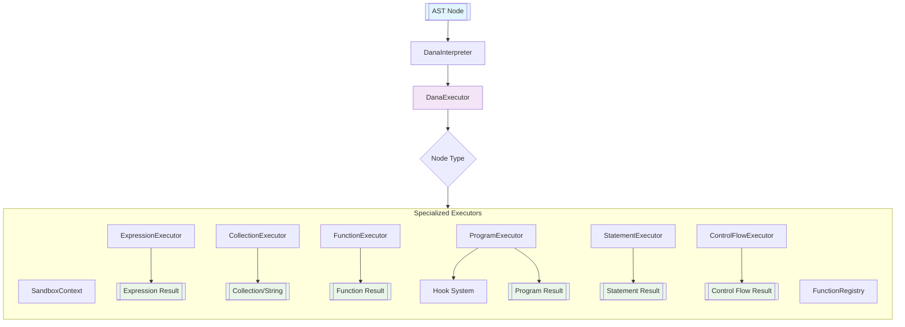

# Dana Interpreter

**Module**: `opendxa.dana.sandbox.interpreter`

Given the program AST after transformation (and optional type checking), we are ready to execute the program.

This document describes the architecture, responsibilities, and flow of the Dana Interpreter, which is responsible for executing Dana programs by traversing the AST and managing sandbox context.

## Overview

The Dana Interpreter has been significantly refactored into a modular, unified execution architecture. It executes Dana programs by processing the Abstract Syntax Tree (AST) through specialized executor components, treating all nodes as expressions that produce values while handling their statement-like side effects.

## Architecture

The interpreter uses a **unified execution model** where every AST node is treated as an expression that produces a value. This provides consistency and simplifies the execution logic while maintaining support for statements that have side effects.

### Key Design Principles

1. **Unified Execution**: All nodes go through a single `execute()` method
2. **Modular Executors**: Specialized executors handle different node types
3. **Value-First**: Every node evaluation produces a value
4. **Dispatcher Pattern**: Node types are mapped to specialized handlers

## Main Components

### Core Interpreter

- **DanaInterpreter**: Main entry point that initializes the execution environment, manages the function registry, and coordinates with the unified executor
- **DanaExecutor**: Central execution engine that dispatches to specialized executors based on node type

### Specialized Executors

- **ExpressionExecutor**: Handles expressions (arithmetic, logical, identifiers, literals, function calls)
- **StatementExecutor**: Executes statements (assignments, conditionals, loops)
- **ControlFlowExecutor**: Manages control flow (if/else, while, for, return, break, continue)
- **CollectionExecutor**: Handles collections and f-string expressions
- **FunctionExecutor**: Manages function definitions and calls
- **ProgramExecutor**: Executes complete programs and statement blocks

### Supporting Infrastructure

- **BaseExecutor**: Base class providing common functionality for all executors
- **FunctionRegistry**: Unified registry for Dana and Python functions with namespacing support
- **SandboxContext**: Provides execution context, variable scope management, and access to LLM resources
- **Hooks**: Extensible hook system for monitoring and extending execution

## Execution Flow



### Execution Steps

1. **AST Node**: Any AST node from the parser (statement, expression, program)
2. **DanaInterpreter**: Entry point that manages context and delegates to DanaExecutor
3. **DanaExecutor**: Central dispatcher that routes nodes to appropriate specialized executors
4. **Specialized Executors**: Handle specific node types using their domain knowledge
5. **Supporting Services**: Function registry, context management, hooks provide infrastructure
6. **Results**: Each executor produces appropriate results (expressions return values, statements may return None but have side effects)

## Key Features

### Unified Execution Model

- **Single Entry Point**: All nodes execute through `DanaExecutor.execute()`
- **Consistent Interface**: Every node produces a value, simplifying chaining and composition
- **Type Dispatch**: Automatic routing to appropriate specialized executors

### Function System Integration

- **Unified Function Registry**: Supports both Dana and Python functions
- **Namespacing**: Functions can be organized into namespaces (e.g., `math.sin`)
- **Context Injection**: Automatic context passing to functions that need it
- **Cross-Language Calls**: Seamless calling between Dana and Python

### Modular Architecture

- **Specialized Executors**: Each executor handles a specific domain (expressions, control flow, etc.)
- **Inheritance Hierarchy**: All executors inherit from `BaseExecutor` for consistency
- **Handler Registration**: Dynamic registration of node type handlers

### Error Handling and Diagnostics

- **Improved Error Messages**: User-friendly error formatting with context
- **Execution Path Tracking**: Debugging support with execution path information
- **Exception Handling**: Proper handling of control flow exceptions (return, break, continue)

## Example Usage

### Basic Program Execution

```python
from opendxa.dana.sandbox.parser.dana_parser import DanaParser
from opendxa.dana.sandbox.interpreter.dana_interpreter import DanaInterpreter
from opendxa.dana.sandbox.sandbox_context import SandboxContext

# Parse Dana code
parser = DanaParser()
result = parser.parse("private:x = 10\nif private:x > 5:\n    print('Value is greater than 5')")

if result.is_valid:
    # Create context and interpreter
    context = SandboxContext()
    interpreter = DanaInterpreter(context)
    
    # Execute the program
    output = interpreter.execute_program(result.program)
    
    # Get any printed output
    printed_output = interpreter.get_and_clear_output()
    print("Execution result:", output)
    print("Program output:", printed_output)
else:
    print("Parse errors:", result.errors)
```

### Single Statement Execution

```python
# Execute a single statement
stmt_result = parser.parse("private:result = 42 * 2")
if stmt_result.is_valid:
    value = interpreter.execute_statement(stmt_result.program, context)
    print("Statement result:", value)
    print("Variable value:", context.get("private:result"))
```

### Expression Evaluation

```python
# Evaluate an expression
expr_result = parser.parse("10 + 20 * 3")
if expr_result.is_valid:
    value = interpreter.evaluate_expression(expr_result.program, context)
    print("Expression value:", value)  # Output: 70
```

## Advanced Features

### Function Registration and Calling

```python
# Register a Python function
def my_function(a, b):
    return a + b

interpreter.function_registry.register(
    "add", my_function, namespace="math", func_type="python"
)

# Call from Dana code
code = "result = math.add(10, 20)"
result = parser.parse(code)
interpreter.execute_program(result.program)
print(context.get("local:result"))  # Output: 30
```

### Hook System

```python
from opendxa.dana.sandbox.interpreter.hooks import HookRegistry, HookType

def before_execution_hook(context):
    print("About to execute:", context["node"])

# Register hook
HookRegistry.register(HookType.BEFORE_EXECUTION, before_execution_hook)
```

## Error Handling

The interpreter provides comprehensive error handling:

- **SandboxError**: Base exception for execution errors
- **Improved Error Messages**: User-friendly formatting with context information
- **Execution Status Tracking**: Monitor execution state (RUNNING, COMPLETED, FAILED)
- **Error Context**: Detailed information about where errors occur

```python
from opendxa.dana.common.exceptions import SandboxError

try:
    result = interpreter.execute_program(program)
except SandboxError as e:
    print(f"Execution failed: {e}")
    print(f"Execution status: {context.execution_status}")
```

## Extensibility

The modular architecture makes the interpreter highly extensible:

### Adding New Node Types

1. **Create Specialized Executor**: Extend `BaseExecutor` for new node categories
2. **Register Handlers**: Map node types to handler methods
3. **Integrate with DanaExecutor**: Add to the executor hierarchy

### Custom Function Types

```python
from opendxa.dana.sandbox.interpreter.functions.sandbox_function import SandboxFunction

class CustomFunction(SandboxFunction):
    def execute(self, context, *args, **kwargs):
        # Custom function logic
        return result

# Register custom function
interpreter.function_registry.register(
    "custom", CustomFunction(), func_type="custom"
)
```

### Extending Executors

```python
class CustomExpressionExecutor(ExpressionExecutor):
    def __init__(self, parent_executor):
        super().__init__(parent_executor)
        # Register handlers for new expression types
        self._handlers[MyCustomExpression] = self._handle_custom_expression
    
    def _handle_custom_expression(self, node, context):
        # Handle custom expression type
        return result
```

---
<p align="center">
Copyright © 2025 Aitomatic, Inc. Licensed under the <a href="../LICENSE.md">MIT License</a>.<br/>
<a href="https://aitomatic.com">https://aitomatic.com</a>
</p> 