<p align="center">
  
</p>

[Project Overview](../README.md) | [Main Documentation](../docs/README.md)

# MCP and A2A Resources Integration

## Overview

OpenDXA's MCP and A2A Resources integration enables seamless bidirectional communication with external agents and tools through standardized protocols. This design extends OpenDXA's resource architecture to support both consuming external services and providing OpenDXA capabilities to external clients via Model Context Protocol (MCP) and Agent-to-Agent (A2A) protocols.

**Core Philosophy**: OpenDXA becomes a universal agent platform that can both leverage external capabilities and contribute to the broader AI ecosystem through standardized protocols, while maintaining its core principles of imperative programming and domain expertise.

## The Resource-Centric Approach

OpenDXA's existing resource abstraction provides the perfect foundation for protocol integration. Both MCP tools and A2A agents are simply specialized types of resources that can be discovered, configured, and utilized within Dana programs.

### **Bidirectional Protocol Support**

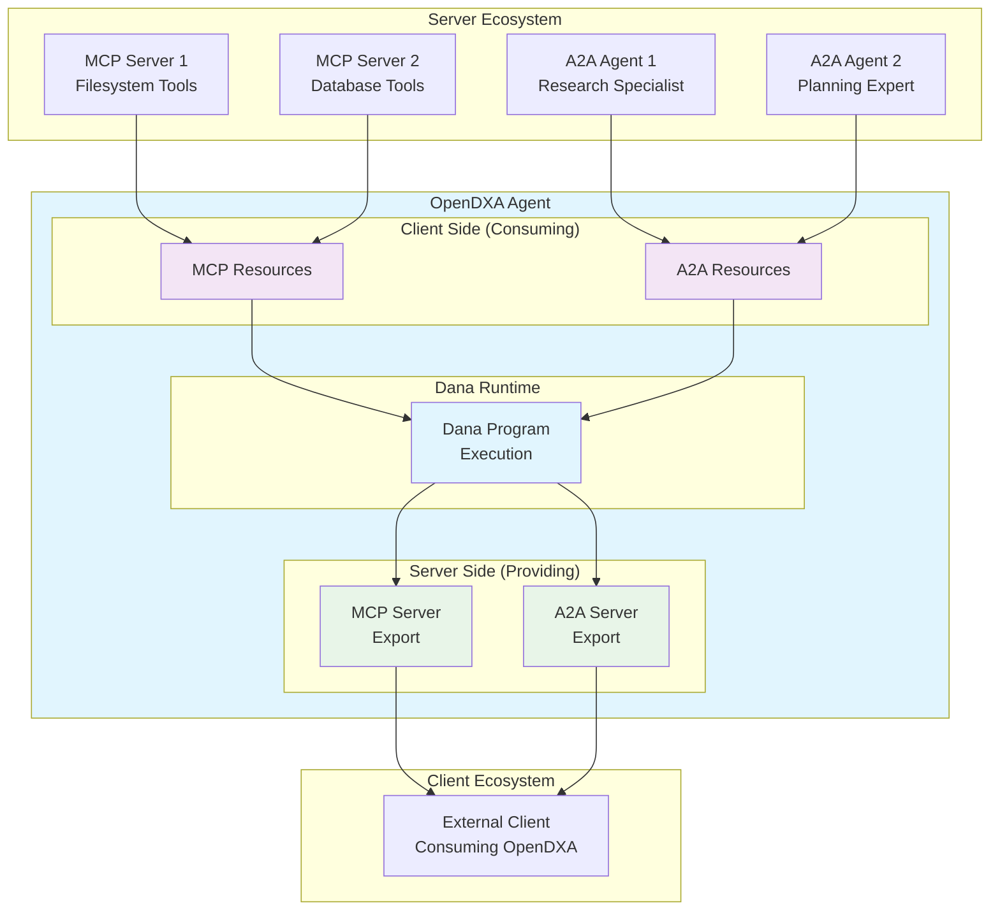

## Architecture Design

### **Resource Type Hierarchy**

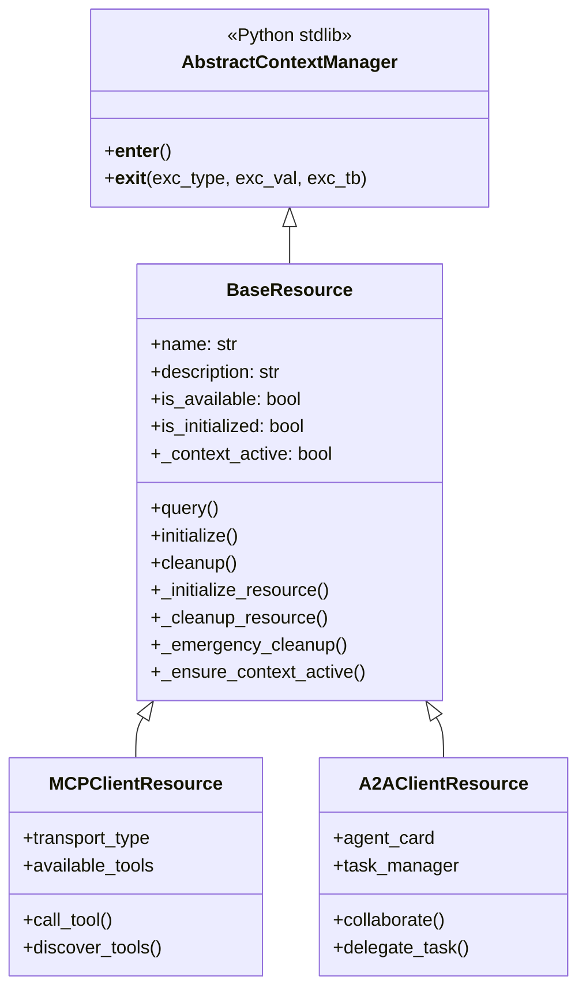

### **Context Management Architecture**

OpenDXA resources implement proper lifecycle management using Python's `contextlib.AbstractContextManager`. This provides:

- **Guaranteed Resource Cleanup**: Connections, sessions, and handles are properly closed
- **Error Resilience**: Resources are cleaned up even when exceptions occur
- **Standard Python Patterns**: Familiar `with` statement usage
- **Template Method Pattern**: BaseResource provides consistent lifecycle with subclass customization

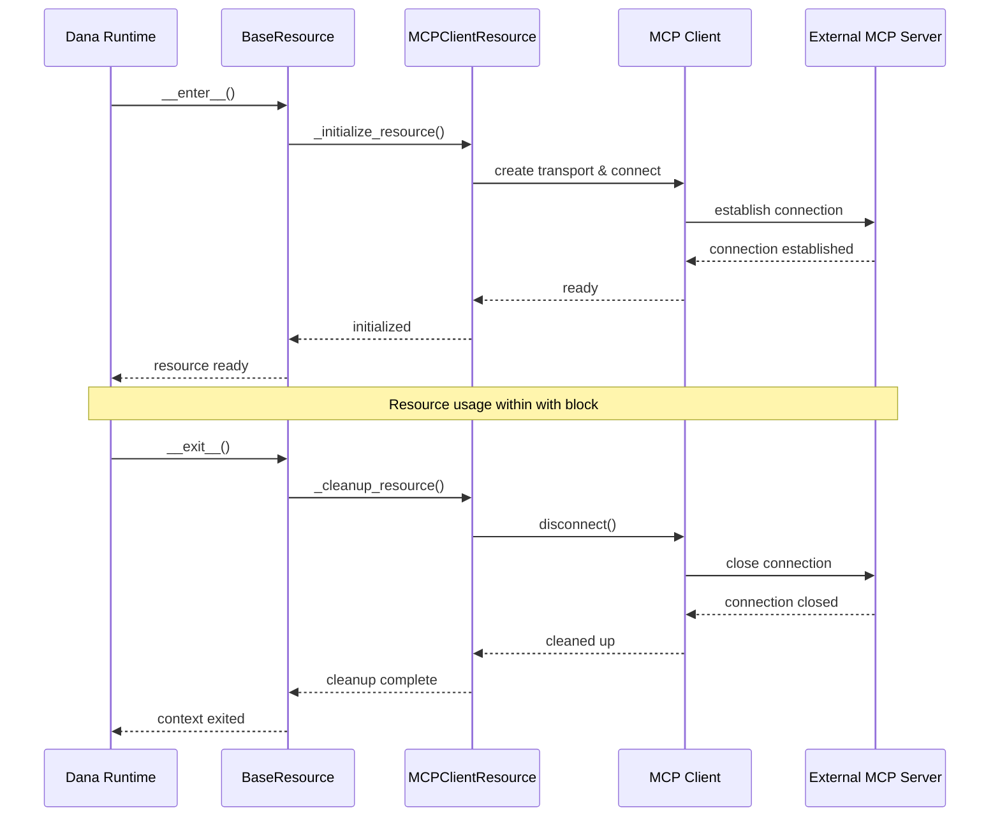

### **Transport Abstraction Layer**

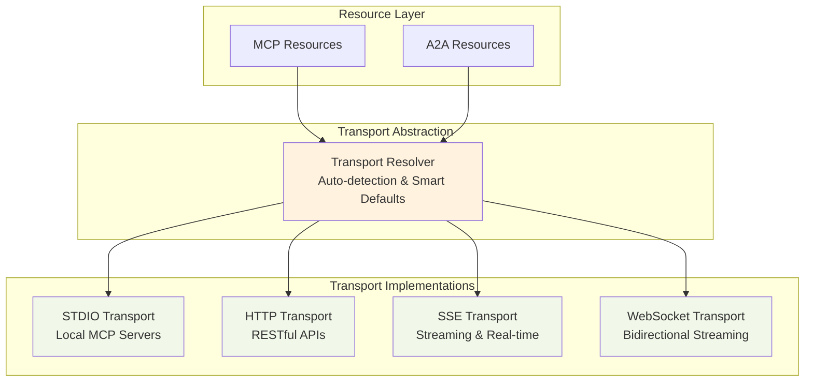

## Module Structure

### **Simplified Protocol Module Organization**

```
opendxa/
  common/
    resource/
      mcp/
        __init__.py
        client/                     # Consuming external MCP servers
          mcp_client.py            # Enhanced JSON-RPC 2.0 client
          mcp_resource.py          # External MCP tools as resources
          tool_importer.py         # Import MCP tools into Dana
          discovery.py             # MCP server discovery
          transport/
            stdio_transport.py
            sse_transport.py  
            http_transport.py
        server/                     # Providing MCP services
          mcp_server_adapter.py    # Anthropic MCP SDK integration
          tool_exporter.py         # Export Dana functions as MCP tools
          resource_exporter.py     # Export OpenDXA resources as MCP resources
      a2a/
        __init__.py
        client/                     # Collaborating with external A2A agents  
          a2a_client.py            # Connect to external A2A agents
          a2a_resource.py          # External agents as resources
          agent_importer.py        # Import A2A agents into Dana
          task_orchestrator.py     # Manage collaborative tasks
          discovery.py             # A2A agent discovery
        server/                     # Providing A2A services
          a2a_server_adapter.py    # Google A2A SDK integration
          agent_card_generator.py  # Generate agent cards
          task_handler.py          # Handle incoming A2A tasks
          session_manager.py       # Manage A2A sessions and state
      protocol_base.py              # Base classes (NLIP-compatible)
  dana/
    integration/
      mcp_integration.py            # MCP tools in Dana namespace
      a2a_integration.py            # A2A agents in Dana namespace
    sandbox/
      interpreter/
        protocol_functions.py       # Protocol function registration
  common/
    config/
      protocol_config.py           # Protocol configuration management
```

**Key Implementation Files:**

- **`protocol_base.py`**: BaseResource with AbstractContextManager implementation
- **`mcp_server_adapter.py`**: Anthropic MCP SDK integration for exposing OpenDXA capabilities
- **`mcp_resource.py`**: MCP client resource with connection lifecycle management  
- **`a2a_server_adapter.py`**: Google A2A SDK integration for exposing OpenDXA capabilities
- **`a2a_resource.py`**: A2A client resource with session lifecycle management
- **`protocol_functions.py`**: Dana interpreter integration for `use()` and `with` statements

## Client Side: Consuming External Services

### **MCP Client Resource Integration**

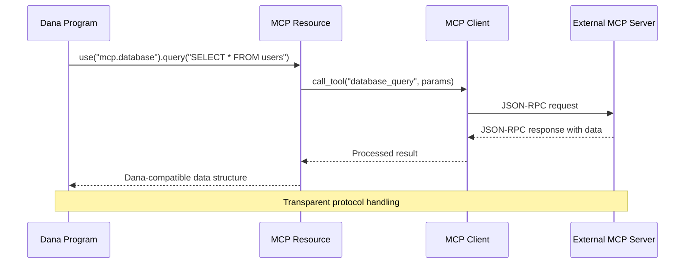

**Key Capabilities:**
- **Automatic Tool Discovery**: Discover and register MCP tools as Dana functions
- **Schema Validation**: Validate parameters against MCP tool schemas
- **Transport Auto-Detection**: Automatically select appropriate transport (stdio, SSE, HTTP)
- **Error Handling**: Convert MCP errors to Dana-compatible exceptions
- **Streaming Support**: Handle long-running MCP operations with progress updates

### **A2A Client Resource Integration**

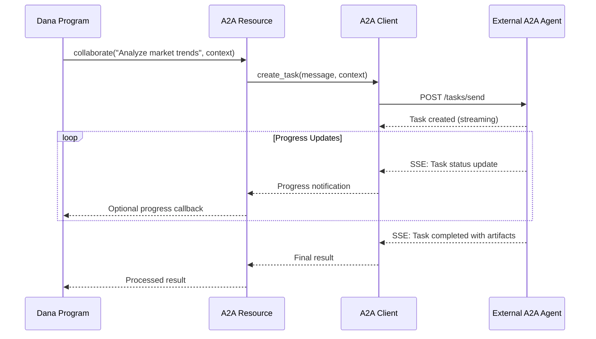

**Key Capabilities:**
- **Agent Discovery**: Discover A2A agents via agent cards and registries
- **Task Orchestration**: Manage task lifecycle and multi-turn conversations
- **Streaming Collaboration**: Real-time progress updates and streaming responses
- **Context Management**: Preserve context across multi-turn agent interactions
- **Capability Matching**: Match tasks to agent capabilities automatically

## Server Side: Providing Services to External Clients

### **MCP Server: Exposing OpenDXA Capabilities**

OpenDXA leverages **Anthropic's official MCP SDK** to expose agent capabilities as MCP tools, ensuring full protocol compliance and compatibility with MCP clients.

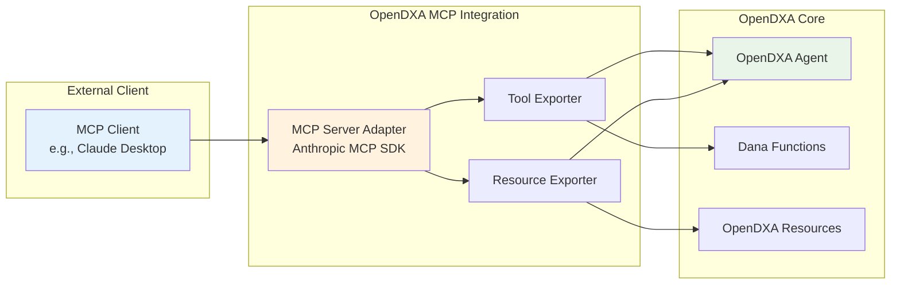

**MCP Server Implementation:**
```python
# Using Anthropic's MCP SDK
from mcp import Server, Tool, Resource
from opendxa.common.resource.mcp.server import OpenDXAMCPAdapter

class OpenDXAMCPAdapter:
    def __init__(self, opendxa_agent):
        self.agent = opendxa_agent
        self.mcp_server = Server(
            name=f"opendxa-{agent.name}",
            version="1.0.0"
        )
        self._export_dana_functions()
        self._export_agent_resources()
        
    def _export_dana_functions(self):
        """Export Dana functions as MCP tools."""
        for func_name, dana_func in self.agent.get_exported_functions():
            tool = Tool(
                name=func_name,
                description=dana_func.description,
                input_schema=dana_func.get_mcp_schema()
            )
            self.mcp_server.add_tool(tool, self._wrap_dana_function(dana_func))
            
    async def _wrap_dana_function(self, dana_func):
        """Wrapper to execute Dana functions via MCP."""
        def tool_handler(arguments):
            # Execute Dana function with MCP arguments
            return self.agent.execute_dana_function(dana_func, arguments)
        return tool_handler
```

**Export Capabilities:**
- **Agent Functions**: Export agent capabilities as MCP tools using Anthropic's Tool interface
- **Dana Functions**: Export custom Dana functions with proper schema validation
- **OpenDXA Resources**: Export resource query capabilities as MCP resources
- **Knowledge Access**: Provide access to agent knowledge bases via MCP prompts
- **Domain Expertise**: Share specialized domain knowledge as contextual resources

### **A2A Server: Exposing OpenDXA as A2A Agent**

OpenDXA leverages **Google's official A2A SDK** to expose agent capabilities as A2A agents, ensuring protocol compliance and compatibility with the broader A2A ecosystem.

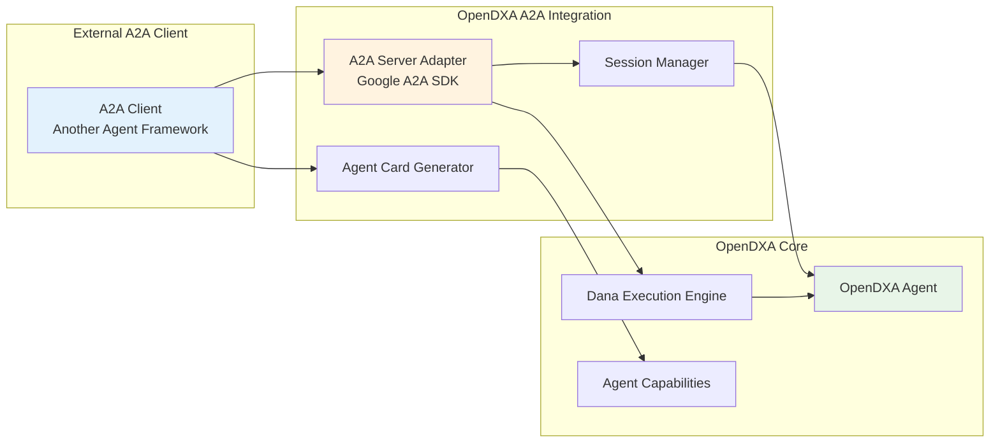

**A2A Server Implementation:**
```python
# Using Google's A2A SDK
from google_a2a import Agent, Task, AgentCard
from opendxa.common.resource.a2a.server import OpenDXAA2AAdapter

class OpenDXAA2AAdapter:
    def __init__(self, opendxa_agent):
        self.agent = opendxa_agent
        self.a2a_agent = Agent(
            name=opendxa_agent.name,
            description=opendxa_agent.description,
            version="1.0.0"
        )
        self._register_capabilities()
        self._setup_task_handlers()
        
    def _register_capabilities(self):
        """Register OpenDXA capabilities with A2A agent."""
        agent_card = AgentCard(
            name=self.agent.name,
            capabilities=self.agent.get_capabilities(),
            supported_protocols=["streaming", "multi-turn"],
            metadata=self.agent.get_metadata()
        )
        self.a2a_agent.set_agent_card(agent_card)
        
    def _setup_task_handlers(self):
        """Set up task handlers for A2A requests."""
        @self.a2a_agent.task_handler
        async def handle_task(task: Task):
            # Execute task through Dana runtime
            async for progress in self.agent.execute_task_stream(
                task.message, 
                task.context
            ):
                yield progress
                
            # Return final result
            return task.complete(self.agent.get_task_result())
```

**A2A Server Capabilities:**
- **Agent Card Generation**: Automatically generate A2A agent cards using Google's AgentCard interface
- **Task Processing**: Handle incoming A2A tasks through Dana execution engine with Google's Task API
- **Multi-turn Conversations**: Support complex, stateful conversations using A2A SDK session management
- **Streaming Responses**: Provide real-time progress updates via A2A SDK streaming capabilities
- **Capability Advertisement**: Advertise agent capabilities using standard A2A discovery mechanisms

**Technology Stack:**
- **Google A2A SDK**: Official A2A protocol implementation with streaming and session support
- **Protocol Compliance**: Full A2A specification compliance via Google's SDK
- **Async Integration**: Native async support for Dana execution and streaming responses
- **Standard Discovery**: Compatible with A2A agent registries and discovery services

## Dana Language Integration

### **Resource Usage Patterns**

OpenDXA supports both **simple resource usage** and **context-managed resources** depending on the use case:

```dana
# Simple usage - automatic cleanup when scope ends
files = use("mcp.filesystem")
data = files.list_directory("/data")

# Context-managed usage - explicit lifecycle control
with use("mcp.database", "https://db.company.com/mcp") as database:
    results = database.query("SELECT * FROM sales WHERE date > '2024-01-01'")
    summary = database.query("SELECT COUNT(*) FROM transactions")
    log.info(f"Found {summary} transactions for {len(results)} records")
# database connection automatically closed here

# Multiple resources with guaranteed cleanup
with:
    files = use("mcp.filesystem")
    database = use("mcp.database") 
    analyst = use("a2a.research-agent")
do:
    # Load and process data
    raw_data = files.read_file("/data/sales_2024.csv")
    historical = database.query("SELECT * FROM sales WHERE year = 2023")
    
    # A2A collaboration with context
    analysis = analyst.analyze("Compare 2024 vs 2023 sales trends", 
                              context={"current": raw_data, "historical": historical})
    
    # Save results
    database.execute(f"INSERT INTO analyses VALUES ('{analysis}', NOW())")
    files.write_file("/reports/sales_analysis_2024.txt", analysis)
# All resources automatically cleaned up here
```

### **Error Handling with Resource Cleanup**

```dana
# Guaranteed cleanup even with errors
with use("a2a.expensive-compute", "https://gpu-cluster.company.com") as agent:
    try:
        results = agent.process_large_dataset("/data/massive_dataset.parquet")
        
        if results.confidence < 0.8:
            enhanced = agent.enhance_analysis(results, iterations=5)
            final_results = enhanced
        else:
            final_results = results
            
    except AnalysisError as e:
        log.error(f"Analysis failed: {e}")
        notifier = use("mcp.notifications")
        notifier.send_alert("Analysis pipeline failed", details=str(e))
        
# agent connection cleaned up regardless of success/failure
```

### **Legacy Pattern Support**

```dana
# Simple assignment pattern (for backward compatibility)
database = use("mcp.database")
results = database.query("SELECT * FROM users")  # Works but no guaranteed cleanup

# Recommended pattern for production usage
with use("mcp.database") as database:
    results = database.query("SELECT * FROM users")  # Guaranteed cleanup
```

## Configuration Design

### **Progressive Configuration Complexity**

**Level 1: Zero Configuration (Just Works)**
```yaml
# Auto-discovery and smart defaults
auto_discovery:
  enabled: true
  mcp_registries: ["local", "https://mcp-registry.company.com"]
  a2a_registries: ["https://agents.company.com"]
```

**Level 2: Simple Configuration**
```yaml
resources:
  mcp:
    filesystem: "local://filesystem_server.py"      # Auto-detects stdio
    database: "https://db.company.com/mcp"          # Auto-detects SSE
    calculator: "ws://calc.company.com/mcp"         # Auto-detects WebSocket
  a2a:
    researcher: "https://research.company.com"       # Auto-detects A2A HTTP
    planner: "https://planning.company.com"          # Auto-detects A2A HTTP
```

**Level 3: Advanced Configuration**
```yaml
resources:
  mcp:
    custom_tool:
      transport: "sse"
      url: "https://api.company.com/mcp"
      auth:
        type: "oauth2"
        client_id: "${MCP_CLIENT_ID}"
      retry_policy:
        max_attempts: 3
        backoff: "exponential"
      timeout: 30
  a2a:
    specialized_agent:
      url: "https://specialist.partner.com"
      capabilities: ["domain-analysis", "report-generation"]
      auth:
        type: "api_key"
        key: "${PARTNER_API_KEY}"
      streaming: true
      task_timeout: 300
```

## Transport Strategy

### **Smart Transport Resolution**

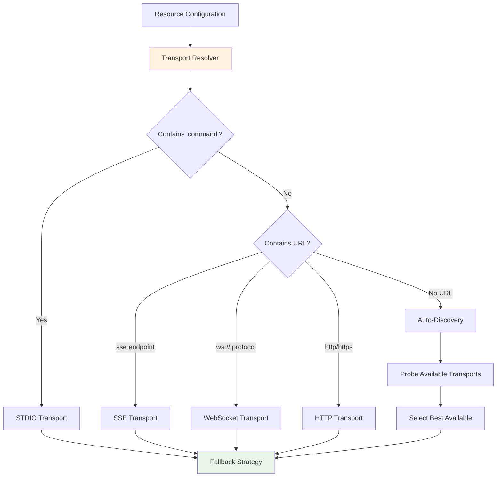

### **Resilient Transport with Fallback**

**Transport Priority for MCP:**
1. **SSE** (preferred for streaming and real-time)
2. **HTTP** (reliable fallback for simple request/response)
3. **WebSocket** (for bidirectional streaming)
4. **STDIO** (for local processes)

**Transport Priority for A2A:**
1. **SSE** (A2A standard for streaming tasks)
2. **HTTP** (fallback for simple tasks)

## Security Design

### **Security Philosophy: Extend, Don't Replace**

Dana's existing sandbox security is excellent for local execution and provides a strong foundation. For MCP/A2A integration, we **extend** this security model with **network-aware protections** rather than replacing it.

**Core Security Principle**: External protocol operations require additional security layers beyond Dana's local sandbox protections.

### **Network Boundary Security**

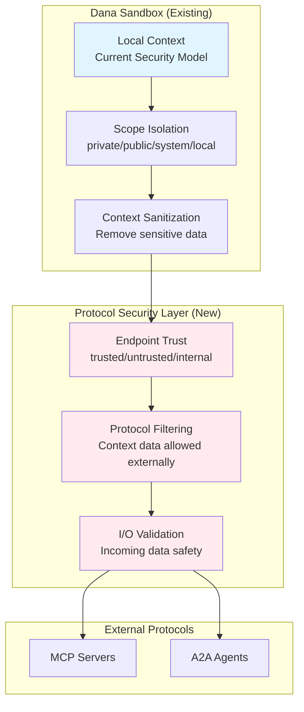

### **Simple Trust Model (KISS)**

**Three Trust Levels** (keeping it simple):

```python
TRUST_LEVELS = {
    "internal": {
        # Same network/organization - higher trust
        "allowed_context": ["public"],  # Can access public scope
        "audit_level": "basic"
    },
    "trusted": {
        # Verified external services - medium trust  
        "allowed_context": [],  # No context access by default
        "audit_level": "standard"
    },
    "untrusted": {
        # Unknown external services - minimal trust
        "allowed_context": [],  # No context access
        "audit_level": "full"
    }
}
```

**Trust Determination** (simple rules):
- **Internal**: localhost, private IP ranges, same-domain endpoints
- **Trusted**: Explicitly configured trusted endpoints (user-defined allowlist)
- **Untrusted**: Everything else (default)

### **Context Protection for Protocols**

**Enhanced SandboxContext sanitization** for network operations:

```python
class SandboxContext:
    def sanitize_for_network(self, endpoint: str) -> "SandboxContext":
        """Network-aware sanitization - extends existing sanitize()."""
        # Start with existing local sanitization
        sanitized = self.copy().sanitize()
        
        # Apply network-specific filtering
        trust_level = self._get_endpoint_trust(endpoint)
        
        if trust_level == "untrusted":
            # Remove all context - only basic tool parameters allowed
            sanitized.clear("public")
        elif trust_level == "trusted":
            # Filter public context to remove sensitive patterns
            sanitized = self._filter_public_context(sanitized)
        # internal endpoints get current sanitized context
        
        return sanitized
```

### **Protocol Resource Security (BaseResource Extension)**

**Secure resource wrapper** with minimal complexity:

```python
class ProtocolResource(BaseResource):
    """Security-enhanced BaseResource for external protocols."""
    
    def __init__(self, name: str, endpoint: str):
        super().__init__(name)
        self.endpoint = endpoint
        self.trust_level = self._determine_trust_level(endpoint)
    
    async def query(self, request: BaseRequest) -> BaseResponse:
        """Override query to add security validation."""
        # Input validation
        validated_request = self._validate_outgoing_request(request)
        
        # Execute with current security
        result = await super().query(validated_request)
        
        # Output validation
        safe_result = self._validate_incoming_response(result)
        
        return safe_result
    
    def _validate_outgoing_request(self, request: BaseRequest) -> BaseRequest:
        """Ensure outgoing requests don't leak sensitive data."""
        # Apply trust-level filtering to request
        # Remove sensitive arguments based on trust level
        pass
    
    def _validate_incoming_response(self, response: BaseResponse) -> BaseResponse:
        """Ensure incoming responses are safe."""
        # Basic safety checks on response content
        # Size limits, content filtering
        pass
```

### **Security Implementation Priorities (YAGNI)**

**Phase 1 - Essential Security (v0.5)**:
- ✅ **Trust level determination** - Simple endpoint classification
- ✅ **Context filtering for networks** - Extend existing sanitize() method  
- ✅ **Basic input/output validation** - Size limits and content safety
- ✅ **Security audit logging** - Track external protocol interactions

**Phase 2 - Enhanced Security (v0.6)**:
- 🔄 **Configurable trust policies** - User-defined endpoint allowlists
- 🔄 **Response content scanning** - Advanced safety validation
- 🔄 **Rate limiting** - Prevent abuse of external services

**Phase 3 - Advanced Security (v0.7)**:
- ⏳ **Dynamic trust scoring** - Reputation-based trust adjustment
- ⏳ **Advanced threat detection** - ML-based anomaly detection
- ⏳ **Formal security policies** - Enterprise policy enforcement

### **Configuration Security (Simple)**

**Zero-config security defaults** with opt-in trust:

```yaml
# Default: All external endpoints are untrusted
# No configuration needed for basic security

# Optional: Define trusted endpoints
security:
  trusted_endpoints:
    - "https://company-mcp.internal.com/*"    # Internal MCP server
    - "https://api.trusted-partner.com/a2a"   # Trusted A2A agent
  
# Optional: Override trust for specific resources
resources:
  mcp:
    company_database:
      endpoint: "https://db.company.com/mcp"
      trust_level: "internal"  # Override auto-detection
```

### **Security Testing Strategy**

**Essential security tests** for each phase:

```python
# Phase 1 Tests
def test_untrusted_endpoint_blocks_context():
    """Verify untrusted endpoints get no context data."""
    
def test_trusted_endpoint_gets_filtered_context():
    """Verify trusted endpoints get sanitized context only."""
    
def test_context_sanitization_for_network():
    """Verify network sanitization removes sensitive data."""

# Phase 2 Tests  
def test_oversized_response_blocked():
    """Verify large responses are rejected safely."""
    
def test_malicious_content_filtered():
    """Verify harmful content patterns are filtered."""
```

### **Security Design Principles**

1. **Secure by Default**: All external endpoints are untrusted unless explicitly configured
2. **Minimal Context Sharing**: Only share data that's explicitly allowed and safe
3. **Layered Security**: Network security layers on top of existing Dana sandbox security
4. **Simple Configuration**: Zero-config security for basic use cases
5. **Audit Everything**: Log all external protocol interactions for security monitoring
6. **Fail Safely**: Security failures block operations rather than allowing unsafe operations

## Implementation Strategy

### **Phase 1: Core Infrastructure (v0.5)**

**BaseResource Context Management:**
- Implement BaseResource with contextlib.AbstractContextManager
- Template method pattern for resource lifecycle management
- Error handling and emergency cleanup protocols
- Integration with Dana interpreter for `with` statement support

**MCP Client Enhancement:**
- Enhance existing MCP implementation with robust JSON-RPC 2.0 support
- Implement transport abstraction layer with context management
- Add automatic tool discovery and registration in Dana
- Support for streaming and long-running operations
- Context manager implementation for connection lifecycle

**A2A Client Foundation:**
- Implement A2A client resource for consuming external agents
- Basic task orchestration and lifecycle management
- Agent discovery and capability matching
- Integration with Dana function namespace
- Session management with proper cleanup

### **Phase 2: Server-Side Capabilities (v0.6)**

**MCP Server Implementation:**
- Integrate Anthropic's MCP SDK for protocol compliance
- Implement OpenDXA-to-MCP adapter layer
- Export Dana functions as MCP tools with proper schema validation
- Export OpenDXA resources as MCP resources
- Support for contextual resources and prompts

**A2A Server Implementation:**
- Integrate Google's A2A SDK for protocol compliance and ecosystem compatibility
- Implement OpenDXA-to-A2A adapter layer using Google's Agent and Task APIs
- Automatic agent card generation using A2A SDK AgentCard interface
- Task handling and multi-turn conversation support via A2A SDK session management
- Streaming response capabilities using A2A SDK native streaming support

### **Phase 3: Advanced Features (v0.7)**

**Enhanced Discovery:**
- Distributed agent and tool registries
- Capability-based matching and selection
- Health monitoring and availability tracking
- Performance optimization and caching

**Enterprise Features:**
- Advanced authentication and authorization
- Monitoring and observability
- Resource governance and policies
- Multi-tenant support

## Security and Trust Model

> **Note**: For comprehensive security design including network boundary protection, trust levels, and context sanitization, see the [Security Design](#security-design) section above.

### **Authentication and Authorization**

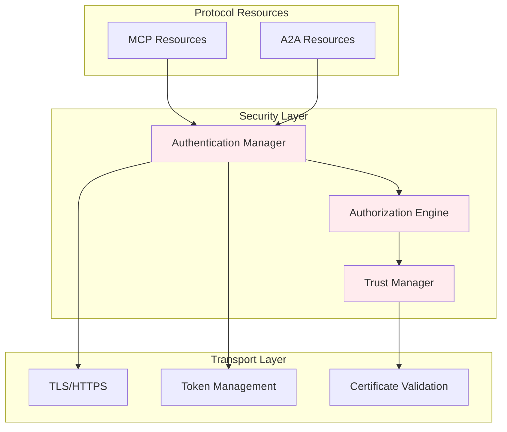

**Authentication Features:**
- **Multiple Auth Schemes**: Support for API keys, OAuth2, mTLS, and custom authentication
- **Transport Security**: Mandatory TLS for remote connections, certificate validation
- **Credential Management**: Secure storage and rotation of authentication credentials
- **Session Management**: Proper session lifecycle with secure token handling

**Authorization Features:**
- **Resource-Level Access Control**: Fine-grained permissions per MCP/A2A resource
- **Operation-Level Permissions**: Control which tools/functions can be accessed
- **Trust-Based Authorization**: Access decisions based on endpoint trust level (see Security Design)
- **Audit Trail**: Comprehensive logging of all authorization decisions

## Success Metrics

### **Technical Metrics**
- **Protocol Compatibility**: 100% compliance with MCP and A2A specifications
- **Performance Overhead**: <5% latency increase for protocol abstraction
- **Resource Discovery**: <2 second average discovery time for new resources
- **Transport Reliability**: 99.9% successful transport auto-selection

### **Integration Metrics**
- **Dana Integration**: Seamless `use()` syntax for all protocol resources
- **Configuration Simplicity**: 80% of use cases require zero explicit transport configuration
- **Error Handling**: Graceful degradation and informative error messages
- **Documentation Coverage**: Complete examples for all major use cases

### **Ecosystem Metrics**
- **MCP Server Ecosystem**: Integration with popular MCP servers (filesystem, database, etc.)
- **A2A Agent Network**: Successful collaboration with external A2A agents
- **Bidirectional Usage**: OpenDXA both consuming and providing services via protocols
- **Community Adoption**: Third-party integration and contribution to OpenDXA protocol support

## Future Considerations

### **NLIP Compatibility**
The architecture is designed to be NLIP-compatible for future protocol federation:
- **Standardized Interfaces**: All protocol resources implement common interface patterns
- **Message Format Compatibility**: Use standardized message formats that NLIP can translate
- **Discovery Federation**: Simple discovery patterns that NLIP can aggregate and orchestrate
- **Protocol Metadata**: Rich metadata that enables intelligent protocol selection and translation

### **Extensibility**
- **Custom Protocol Support**: Plugin architecture for additional protocols
- **Transport Plugins**: Support for custom transport implementations
- **Enhanced Discovery**: Advanced registry federation and peer-to-peer discovery
- **Performance Optimization**: Caching, connection pooling, and batch operations

## Implementation Status

### Completed Features

#### Object Method Call Syntax (✅ IMPLEMENTED)
Dana now supports object-oriented method calls on resources returned by `use()` statements:

```python
# MCP Resource Integration
websearch = use("mcp", url="http://localhost:8880/websearch")
tools = websearch.list_tools()
results = websearch.search("Dana programming language")

# A2A Agent Integration  
analyst = use("a2a.research-agent", "https://agents.company.com")
market_data = analyst.collect_data("tech sector")
analysis = analyst.analyze_trends(market_data)

# With statement resource management
with use("mcp.database") as database:
    users = database.query("SELECT * FROM active_users")
    database.update_analytics(users)
```

**Key Features:**
- ✅ Object method calls with arguments: `obj.method(arg1, arg2)`
- ✅ Async method support using `Misc.safe_asyncio_run`
- ✅ Resource scoping with `with` statements
- ✅ Comprehensive error handling and validation
- ✅ Full test coverage (25 test cases)
- ✅ Complete documentation and examples

### Pending Implementation

#### Enhanced `use()` Syntax
```python
# Current basic syntax (implemented)
websearch = use("mcp", url="http://localhost:8880/websearch")

# Enhanced syntax (planned)  
websearch = use("mcp.websearch", endpoint="http://localhost:8880", timeout=30)
analyst = use("a2a.research-agent", url="https://agents.company.com", auth="bearer_token")
```

#### Resource Lifecycle Management
- Resource pooling and reuse
- Automatic failover and retry logic
- Health monitoring and metrics
- Resource cleanup and garbage collection

---

## Technical Architecture

---

<p align="center">
Copyright © 2025 Aitomatic, Inc. Licensed under the <a href="../../LICENSE.md">MIT License</a>.
<br/>
<a href="https://aitomatic.com">https://aitomatic.com</a>
</p> 
