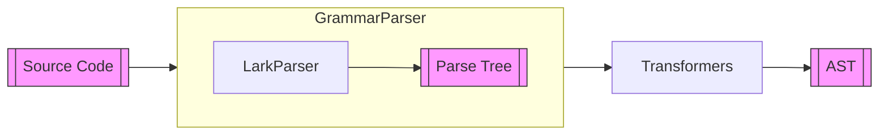

# Dana Parser

**Module**: `opendxa.dana.language.parser`

The Parser is the first step in the Dana language pipeline. It is responsible for converting Dana source code into an Abstract Syntax Tree (AST).

This document describes the architecture, responsibilities, and flow of the Dana parser, which is responsible for converting Dana source code into an Abstract Syntax Tree (AST).

## Overview

The Dana parser is built on top of the [Lark](https://github.com/lark-parser/lark) parsing library. It is responsible for:

- Loading the Dana [grammar](./dana/grammar.md) (from file or embedded)
- Parsing source code into a parse tree
- Transforming the parse tree into a Dana AST using modular transformers
- Optionally performing type checking on the AST
- Providing detailed error reporting and diagnostics

## Main Components

- **GrammarParser**: The main parser class. Handles grammar loading, Lark parser instantiation, and the overall parse/transform/typecheck pipeline.
- **DanaIndenter**: Custom indenter for handling Dana's indentation-based block structure.
- **LarkTransformer**: The main transformer passed to Lark, which delegates to specialized transformers for statements, expressions, and f-strings.
- **ParseResult**: Named tuple containing the parsed AST and any errors.

## Parser Flow



- **Source Code**: The Dana program as a string.
- **GrammarParser**: Loads grammar, sets up Lark, and manages the pipeline.
- **Lark Parser**: Parses the source code into a parse tree using the Dana grammar.
- **Parse Tree**: The syntactic structure produced by Lark.
- **LarkTransformer**: Transforms the parse tree into a Dana AST.
- **AST**: The abstract syntax tree, ready for type checking and interpretation.

## Error Handling

The parser provides detailed error messages and diagnostics using custom exceptions and error utilities. Unexpected input and other parse errors are caught and reported in the `ParseResult`.

## Type Checking

Type checking is optional and can be enabled or disabled via environment variable or function argument. If enabled, the parser will invoke the type checker on the resulting AST after successful parsing.

## Example Usage

```python
from opendxa.dana.language.parser import GrammarParser

parser = DanaParser()
result = parser.parse("x = 42\nprint(x)")

if result.is_valid:
    print("Parsed program:", result.program)
else:
    print("Errors:", result.errors)
```

---
<p align="center">
Copyright © 2025 Aitomatic, Inc. Licensed under the <a href="../../../LICENSE.md">MIT License</a>.<br/>
<a href="https://aitomatic.com">https://aitomatic.com</a>
</p> 