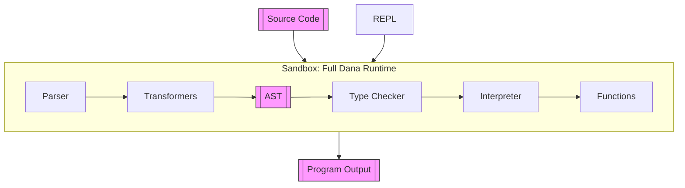

# Dana Secure Sandbox 

## Overview

The Dana runtime is designed to securely and robustly process and execute code from various sources, such as scripts and interactive REPL sessions. All stages of code processing and execution are contained within a Sandbox, which provides isolation, security, and resource management.

## Runtime Flow

At a high level, the Dana runtime flow is as follows:

1. [`opendxa.dana.language.parser`](./parser.md): Parses the source code into a parse tree.
2. [`opendxa.dana.language.dana_grammar.lark`](./dana/grammar.md): The Dana grammar (Lark grammar).
3. [`opendxa.dana.language.transformers`](./transformers.md): Transforms the parse tree into an AST.
4. [`opendxa.dana.language.type_checker`](./type-checker.md): Type checks the AST.
5. [`opendxa.dana.runtime.interpreter`](./interpreter.md): Executes the AST.

## Flow Diagram

## Stages Explained

- **Source Code / REPL**: Entry points for user code, either as scripts or interactive input.
- **Sandbox**: The top-level runtime container that manages all code processing and execution, ensuring isolation and security.
    - **Parser**: Converts source code into a parse tree using the Dana grammar.
    - **Parse Tree**: The syntactic structure of the code as produced by the parser.
    - **Transformers**: Convert the parse tree into an Abstract Syntax Tree (AST) of Dana node classes.
    - **AST**: A semantically meaningful representation of the program.
    - **Type Checker**: (Optional) Ensures type correctness throughout the AST.
    - **Interpreter**: Executes the AST, managing state and control flow.
    - **Core Functions**: Built-in functions (e.g., `log`, `reason`) invoked during execution.
- **Program Output**: The result or side effects produced by running the program.

## Notes
- The Sandbox ensures that all code, regardless of origin, is processed and executed in a controlled environment.
- The REPL and script execution share the same runtime pipeline.
- Type checking is optional but recommended for safety. 

---

Copyright © 2025 Aitomatic, Inc. Licensed under the <a href="../LICENSE.md">MIT License</a>. 
<a href="https://aitomatic.com">https://aitomatic.com</a>

 