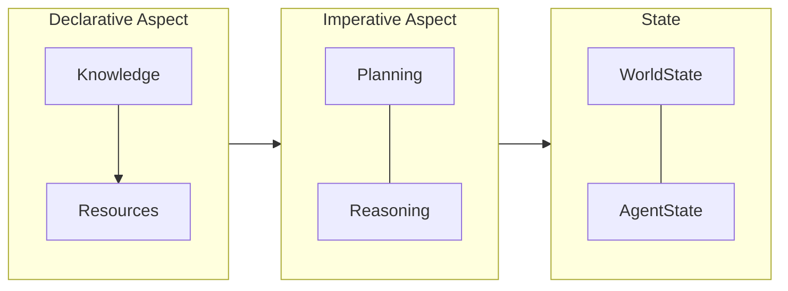
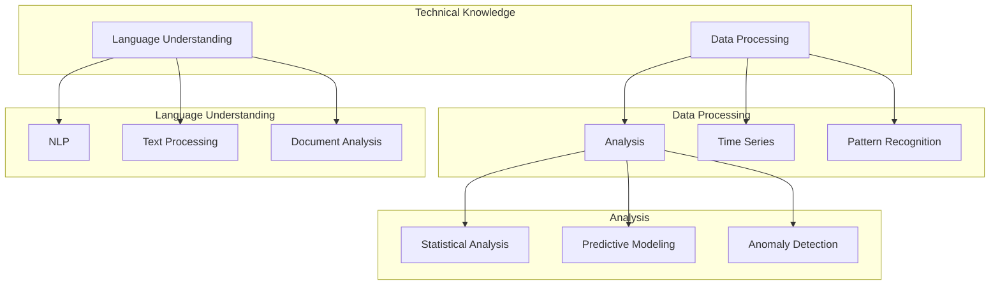
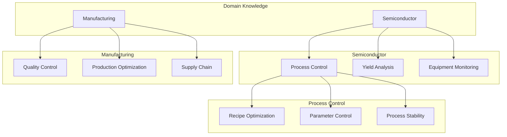

<!-- markdownlint-disable MD041 -->
<!-- markdownlint-disable MD033 -->
# OpenDXA Architecture

## Architecture Overview

The Domain-Expert Agent architecture is built around two fundamental aspects:

1. **Declarative Aspect**
   - Defines what the agent knows
   - Manages knowledge and resources
   - Handles domain expertise
   - Provides structured access to knowledge

2. **Imperative Aspect**
   - Implements planning and reasoning
   - Executes tasks using available knowledge
   - Manages state and context
   - Coordinates multi-agent interactions

This architecture is complemented by built-in knowledge management, enabling:
- Structured storage and retrieval of domain knowledge
- Versioning and evolution of knowledge
- Integration with external knowledge sources
- Efficient querying and reasoning over knowledge



## Knowledge Structure

### Technical Knowledge



### Domain Knowledge



## Implementation

### Engineering Approaches

OpenDXA follows three key engineering principles that guide its architecture and implementation:

1. **Progressive Complexity**
   - Start with simple implementations
   - Add complexity incrementally
   - Maintain clarity at each level
   - Enable gradual learning curve

2. **Composable Architecture**
   - Mix and match components
   - Highly customizable agents
   - Flexible integration points
   - Reusable building blocks

3. **Clean Separation of Concerns**
   - Clear component boundaries
   - Well-defined interfaces
   - Minimal dependencies
   - Maintainable codebase

## Project Structure

```text
opendxa/
├── agent/                  # Agent system
│   ├── capability/        # Cognitive abilities
│   ├── resource/         # External tools & services
│   ├── io/              # Input/Output handling
│   └── state/           # State management
├── common/               # Shared utilities
│   └── utils/           # Utility functions
│       └── logging.py   # Logging configuration
├── execution/            # Execution system
│   ├── pipeline/       # Pipeline execution
│   │   └── executor.py # WorkflowExecutor
│   ├── planning/       # Strategic planning
│   ├── workflow/       # Process workflows
│   │   └── workflow.py # Workflow implementation
│   └── reasoning/      # Reasoning patterns
└── factory/            # Factory components
```

---
<p align="center">
Copyright © 2025 Aitomatic, Inc. Licensed under the <a href="../../LICENSE.md">MIT License</a>.
<br/>
<a href="https://aitomatic.com">https://aitomatic.com</a>
</p>
