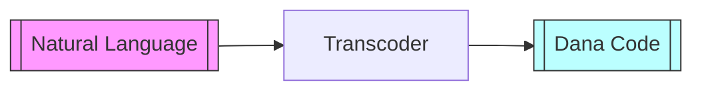
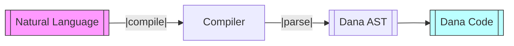
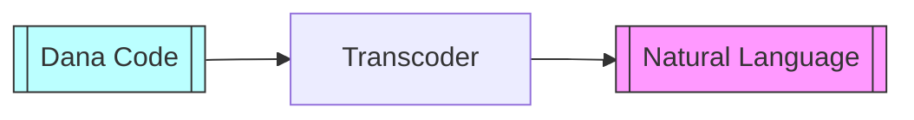
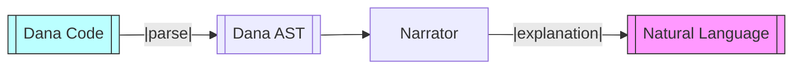

# Dana Transcoder

**Module**: `opendxa.dana.transcoder`

This document describes the Dana Transcoder module, which provides translation between natural language and Dana code, as well as interfaces for programmatic compilation and narration.

## Overview

The Dana Transcoder enables two-way translation:
- **Natural Language → Dana Code**: Converts user objectives or instructions into valid Dana programs using LLMs.
- **Dana Code → Natural Language**: Generates human-readable explanations of Dana programs.

This is achieved through a modular architecture with clear interfaces for extensibility and integration with LLMs.

## Main Components

- **Transcoder**: Main class for NL↔︎Dana translation. Uses an LLM resource and the Dana parser.
- **CompilerInterface**: Abstract interface for compilers that generate Dana ASTs from NL objectives.
- **NarratorInterface**: Abstract interface for narrators that generate NL descriptions from Dana ASTs.

## Transcoder Flow

**Natural Language to Dana Code:**

- `Transcoder.to_dana()`

- `Compiler.compile()`

**Dana Code to Natural Language:**

- `Transcoder.to_natural_language()`

- `Narrator.narrate()`

