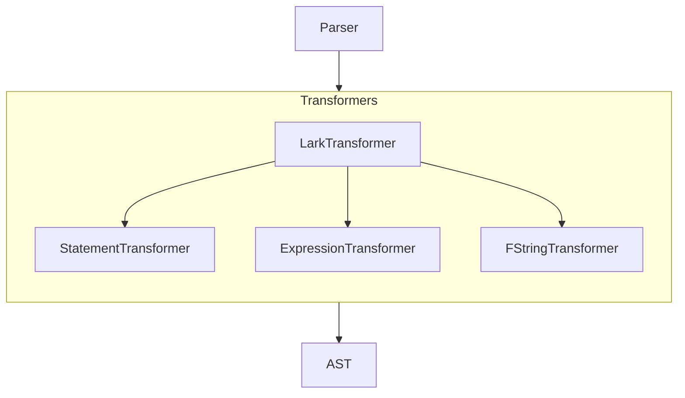

# Dana Language Transformers 

**Module**: `opendxa.dana.language.transformers`

After initial parsing, the Lark parser calls its transformer to output the AST (Abstract Syntax Tree).

This module describes the transformer components for the Dana language parser. The parser uses a modular architecture with specialized transformer classes for different language constructs.

## Structure

- **lark_transformer.py**: Main entry point for Lark. Inherits from `lark.Transformer` and delegates transformation methods to the specialized transformers below.

    - **expression_transformer.py**: Handles transformation of expressions (binary operations, literals, function calls, etc.).

    - **statement_transformer.py**: Handles transformation of statements (assignments, conditionals, loops, log/print/reason statements, etc.).

    - **fstring_transformer.py**: Handles parsing and transformation of f-string expressions, supporting embedded expressions and variable substitution.

    - **base_transformer.py**: Base class with shared utility methods for all the specialized transformers.

## Transformer Delegation and Flow



## Naming Rules for Transformer Methods

Transformer method names must follow these rules and conventions:

- **Lark Rule Matching:**
  - The method name must match the grammar rule name exactly (case-sensitive, usually snake_case).
  - For example, a grammar rule `assignment: ...` requires a method `def assignment(self, items):`.
- **Token Handlers:**
  - To handle a specific token (e.g., `NUMBER`, `STRING`), define a method with the same name: `def NUMBER(self, token):`.
- **Start Rule:**
  - The method for the start rule (e.g., `start`) is called for the root of the parse tree.
- **Helper Methods:**
  - Methods not corresponding to grammar rules should be prefixed with an underscore (e.g., `_unwrap_tree`). Lark will not call these.
- **No Overloading:**
  - Each rule or token should have a unique handler; Lark does not support method overloading.
- **No Dunder Methods:**
  - Avoid using double underscores except for Python special methods (e.g., `__getattr__`).

**Example:**

```python
class MyTransformer(Transformer):
    def assignment(self, items):
        # Handles 'assignment' rule
        ...

    def NUMBER(self, token):
        # Handles NUMBER token
        return int(token)

    def _helper(self, x):
        # Not called by Lark, for internal use
        ...
```

## Usage

The `LarkTransformer` class is the main transformer passed to the Lark parser. It delegates transformation to the specialized transformers for statements, expressions, and f-strings.

## Testing

Tests for the parser and transformers are in `tests/dana/test_modular_parser.py`.  
To run the tests:

```bash
python -m pytest tests/dana/test_modular_parser.py
```

## Benefits of the Modular Design

1. **Improved Maintainability**: Smaller, focused components are easier to understand and maintain.
2. **Better Error Handling**: Shared utilities provide more consistent error messages.
3. **Easier Extension**: Adding new language features is easier with the modular design.
4. **Better Testing**: More focused components allow for more precise tests.

## Future Improvements

- Add more extensive test coverage.
- Further break down large transformer methods.
- Add better documentation for each transformer method.
- Optimize performance by reducing redundant operations.
- Consider a visitor-based approach for error handling.

---
<p align="center">
Copyright © 2025 Aitomatic, Inc. Licensed under the <a href="../../../LICENSE.md">MIT License</a>.<br/>
<a href="https://aitomatic.com">https://aitomatic.com</a>
</p> 