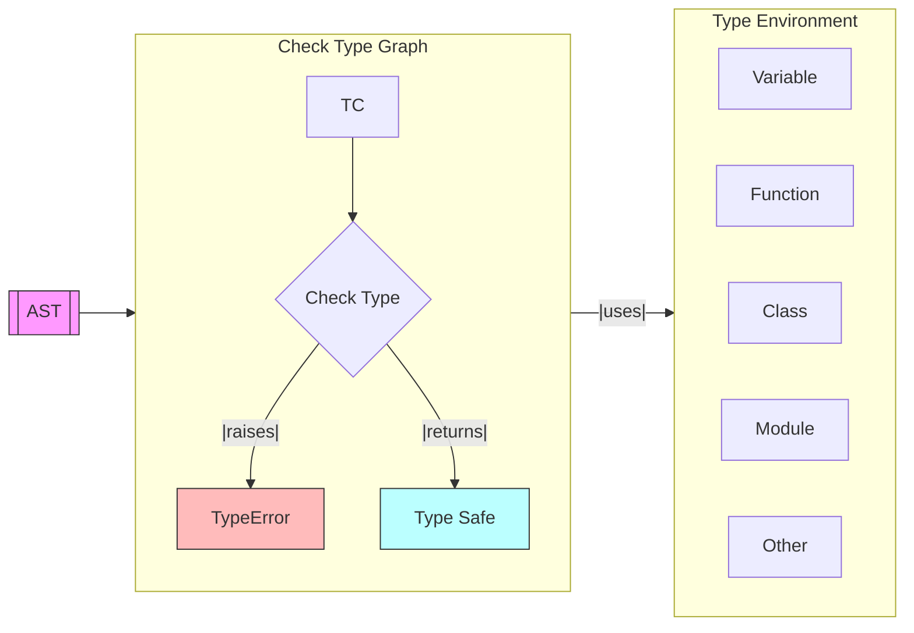

# Dana Type Checker

**Module**: `opendxa.dana.language.type_checker`

This document describes the architecture, responsibilities, and flow of the Dana type checker, which is responsible for statically verifying type correctness in Dana programs after parsing and before execution.

## Overview

After the Transformer has transformed the Program into an AST, the TypeChecker (optionally) traverses the AST and ensures that all operations, assignments, and expressions are type-safe according to the Dana type system. It helps catch type errors early, before program execution, and provides detailed error messages for debugging.

The Interpreter will receive the AST following the TypeChecking phase.

## Main Components

- **DanaType**: Represents a type in Dana (e.g., `int`, `float`, `string`, `bool`, `array`, `dict`, `set`, `null`).
- **TypeEnvironment**: Maintains a mapping of variable names to their types, supporting nested scopes.
- **TypeChecker**: The main class that traverses the AST and checks types for statements and expressions.
- **TypeError**: Custom exception raised when a type error is detected.

## Type Checking Flow



- **AST**: The abstract syntax tree produced by the parser.
- **TypeChecker**: Walks the AST, checking each node for type correctness.
- **TypeEnvironment**: Tracks variable types and supports nested scopes.
- **TypeError**: Raised if a type violation is found; otherwise, the program is type safe.

## Responsibilities

- Check assignments for type compatibility.
- Ensure conditionals and loop conditions are boolean.
- Validate function calls and argument types.
- Check binary and unary operations for operand type compatibility.
- Track variable types and scope.
- Provide clear error messages for type violations.

## Example Usage

```python
from opendxa.dana.language.parser import GrammarParser
from opendxa.dana.language.type_checker import TypeChecker

parser = DanaParser()
result = parser.parse("x = 10\nif x > 5:\n    print('ok')")

if result.is_valid:
    TypeChecker.check_types(result.program)
    print("Type check passed!")
else:
    print("Parse errors:", result.errors)
```

## Error Handling

The type checker raises a `TypeError` (from `opendxa.dana.common.exceptions`) when a type violation is detected. Errors include:
- Assigning a value of the wrong type to a variable
- Using non-boolean expressions in conditions
- Applying operators to incompatible types
- Referencing undefined variables

## Supported Types

- `int`, `float`, `string`, `bool`, `array`, `dict`, `set`, `null`

## Extensibility

The type checker is designed to be extensible. New types, rules, or more advanced type inference can be added by extending the `DanaType`, `TypeEnvironment`, and `TypeChecker` classes.

## Example Type Errors

- Assigning a string to an integer variable:
  ```
  x = 42
  x = "hello"  # TypeError: Binary expression operands must be of the same type, got int and string
  ```
- Using a non-boolean in a condition:
  ```
  if 123:
      print("bad")  # TypeError: Condition must be boolean, got int
  ```
- Referencing an undefined variable:
  ```
  print(y)  # TypeError: Undefined variable: y
  ```

---
<p align="center">
Copyright © 2025 Aitomatic, Inc. Licensed under the <a href="../LICENSE.md">MIT License</a>.<br/>
<a href="https://aitomatic.com">https://aitomatic.com</a>
</p> 