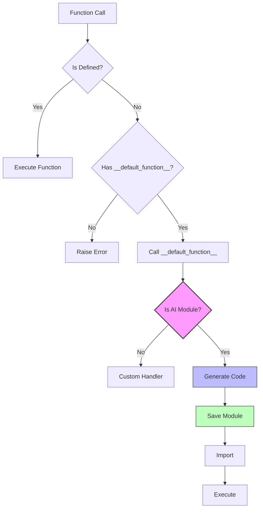
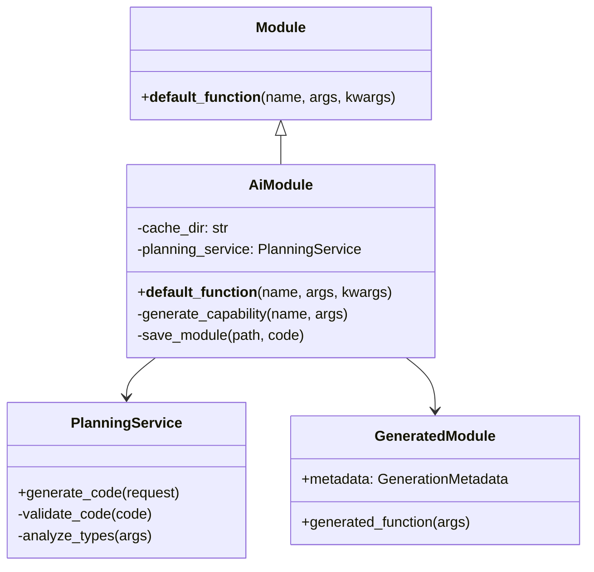
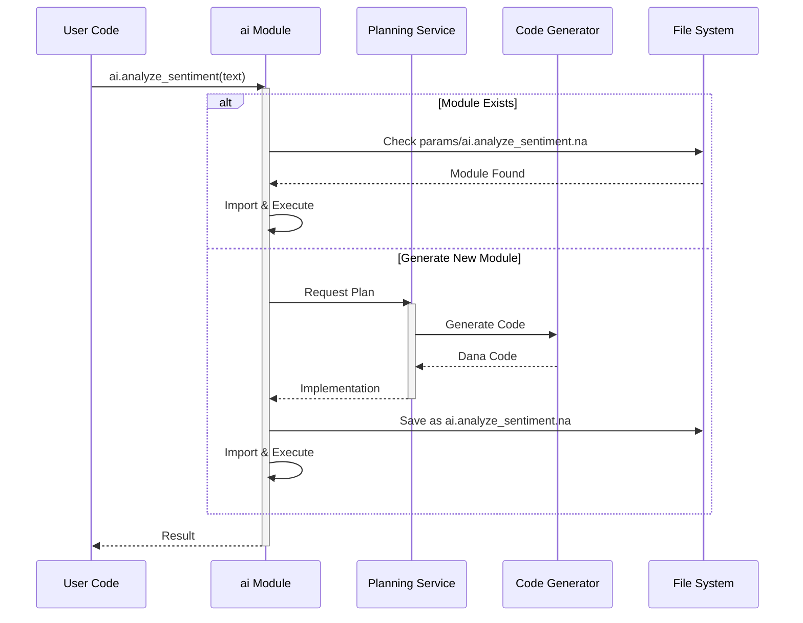
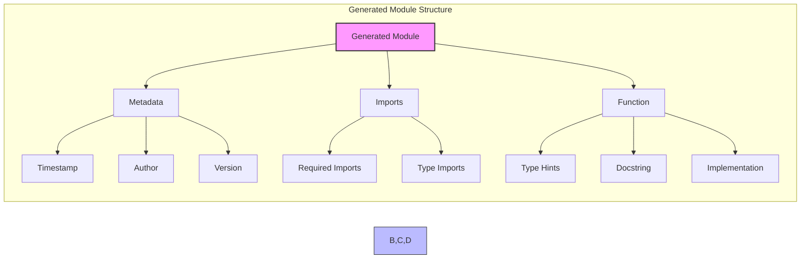
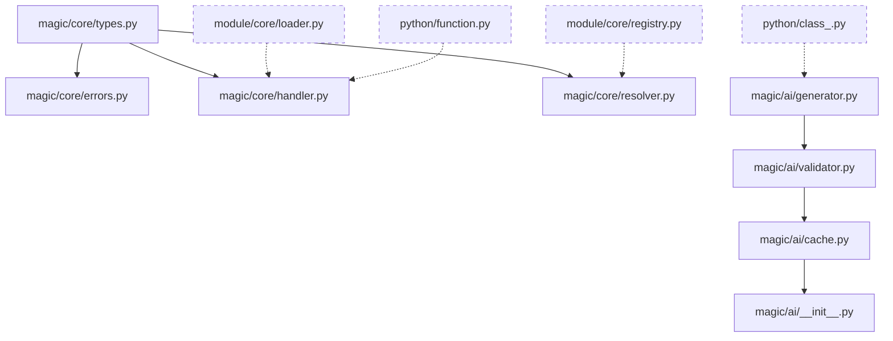

| [← Modules and Imports](./modules_and_imports.md) | [Error Handling →](./error_handling.md) |
|---|---|

# Design Document: AI Magic Functions in Dana

```text
Author: Christopher Nguyen
Version: 0.3
Status: Design Phase
Module: opendxa.dana
```

## Problem Statement

The promise of AI is that it can *do what I mean*. But AI coders still cannot just call arbitray functions and expect them to understand the context and get useful work done.

Dana needs a mechanism to dynamically generate and integrate new capabilities through AI-powered code generation. Currently, developers must:
- Manually write all functionality, even for common patterns
- Pre-define all methods and capabilities at design time
- Maintain a large codebase of utility functions
- Spend time implementing boilerplate code

What if Dana can provide this?

We need a way to dynamically generate domain-specific capabilities through natural language requests to an AI service, which can then be seamlessly integrated into the Dana runtime. This would allow developers to express their intent in natural language and have Dana automatically generate the corresponding implementation.

## Goals

Our primary goal is to create a system where developers can naturally express what they want to accomplish, and have Dana automatically generate the necessary code. This includes:

- Enable dynamic generation of Dana code through AI planning
- Allow developers to request new capabilities using natural language
- Automatically generate, validate, and integrate AI-generated code
- Create a persistent cache of generated capabilities
- Maintain type safety and security while allowing dynamic code generation
- Provide a simple, intuitive interface through the `ai` module reference
- Generate well-documented, type-safe Dana modules
- Enable any module to handle unresolved function calls through `__default_function__`

## Non-Goals

To maintain focus and ensure security, we explicitly exclude certain capabilities:

- We will not allow arbitrary code execution without validation
- We will not modify existing code or modules
- We will not support runtime modification of generated code
- We will not cache failed generations or invalid code
- We will not allow `__default_function__` to modify existing functions

## Proposed Solution

### 1. Function Resolution Flow

The following diagram shows how function calls are resolved and potentially handled by the AI system:



### 2. AI Module Architecture

The following class diagram shows the relationships between components:



### 3. Generation Process

The following sequence diagram shows how code is generated and cached:



### 4. Generated Module Structure

The following diagram shows the structure of generated modules:



## Example Use Cases

The `__default_function__` mechanism enables several powerful patterns. Here are three common use cases:

### 1. Dynamic API Client
This pattern automatically converts function calls into API requests, making it easy to create clean interfaces to REST APIs:

```dana
module api_client:
    base_url: str = "https://api.example.com"
    
    def __default_function__(name: str, args: list, kwargs: dict) -> any:
        """Convert function calls to API requests."""
        endpoint = name.replace("_", "/")
        return http.request(f"{base_url}/{endpoint}", *args, **kwargs)
```

### 2. Proxy Pattern
The proxy pattern allows for transparent forwarding of method calls, useful for implementing middleware, logging, or access control:

```dana
module proxy:
    target: any
    
    def __default_function__(name: str, args: list, kwargs: dict) -> any:
        """Forward calls to target object."""
        if hasattr(target, name):
            return getattr(target, name)(*args, **kwargs)
        raise UndefinedError(f"No such method: {name}")
```

### 3. AI Code Generation
The AI module uses `__default_function__` to provide dynamic code generation capabilities:

```dana
module ai:
    def __default_function__(name: str, args: list, kwargs: dict) -> any:
        """Generate and execute Dana code for the requested capability."""
        return generate_and_execute(name, args, kwargs)
```

## Security Considerations

Security is paramount when dealing with dynamic code generation. Our approach includes multiple layers of protection:

1. **Code Generation**:
- Validate generated code through static analysis
- Execute generated code in a sandboxed environment
- Enforce resource limits to prevent abuse

2. **Module Access**:
- Implement strict controls on which modules can use `__default_function__`
- Maintain comprehensive audit trails of generated code
- Apply access controls to generated modules

## Performance Optimization

Performance is optimized through several strategies:

1. **Caching**:
- Cache generated modules to disk for reuse
- Cache type information to speed up validation
- Cache validation results to avoid redundant checks

2. **Lazy Loading**:
- Load generated modules only when needed
- Implement automatic cleanup of unused modules
- Support background generation for anticipated needs

## Implementation Phases

The implementation is divided into logical phases to manage complexity:

### Phase 1: Core Default Function
- [ ] Implement `__default_function__` mechanism
- [ ] Add module resolution logic
- [ ] Basic type checking
- [ ] Error handling

### Phase 2: AI Integration
- [ ] AI module implementation
- [ ] Planning service integration
- [ ] Code generation
- [ ] Module caching

### Phase 3: Advanced Features
- [ ] Type inference
- [ ] Security measures
- [ ] Performance optimization
- [ ] Documentation

## Design Review Checklist

- [ ] Security review completed
- [ ] Performance impact assessed
- [ ] Error handling comprehensive
- [ ] Testing strategy defined
- [ ] Documentation planned
- [ ] Scalability considered
- [ ] Maintenance overhead evaluated
- [ ] Backwards compatibility checked
- [ ] Dependencies identified
- [ ] Resource requirements estimated

## Implementation Phases

### Phase 1: Core Implementation
- [ ] AI reference structure
- [ ] Basic code generation
- [ ] Module caching
- [ ] Initial validation

### Phase 2: Planning Service
- [ ] Service integration
- [ ] Code generation templates
- [ ] Type inference
- [ ] Documentation generation

### Phase 3: Production Readiness
- [ ] Security measures
- [ ] Performance optimization
- [ ] Comprehensive testing
- [ ] User documentation
- [ ] Example capabilities

## Implementation Sequence

The magic function system builds on both the module system and Python integration. Implementation will proceed in this order:



### Prerequisites (Week 0)
Before starting magic functions implementation:
```
✓ Module system core (from modules_and_imports.md)
✓ Python integration (from python_integration.md)
```

### 1. Core Magic System (Week 1)
First implement the foundational magic function mechanism:
```
opendxa/dana/magic/core/types.py    # Magic function types
opendxa/dana/magic/core/errors.py   # Error handling
opendxa/dana/magic/core/handler.py  # Default handler
opendxa/dana/magic/core/resolver.py # Function resolution
```

Key tasks:
- Define magic function types
- Create error hierarchy
- Implement default handler
- Build resolution pipeline

### 2. AI Generator Core (Week 2)
Build the core AI code generation system:
```
opendxa/dana/magic/ai/generator.py  # Code generation
opendxa/dana/magic/ai/validator.py  # Code validation
```

Key tasks:
- Implement code generator
- Add code validation
- Create test suite
- Add security checks

### 3. AI Module System (Week 3)
Implement the AI module caching and management:
```
opendxa/dana/magic/ai/cache.py     # Module caching
opendxa/dana/magic/ai/__init__.py  # AI module
```

Key tasks:
- Build module cache
- Implement AI module
- Add resource management
- Create integration tests

### Dependencies and Testing

Each component should:
1. Have unit tests for core functionality
2. Include integration tests with module system
3. Include integration tests with Python system
4. Pass all Dana linting requirements
5. Include comprehensive docstrings
6. Be reviewed before proceeding

### Implementation Guidelines

1. **Security First**: 
   - Validate all generated code
   - Sandbox AI operations
   - Clear security boundaries

2. **Testing Strategy**:
   - Unit tests for each component
   - Integration tests with module system
   - Integration tests with Python system
   - Security tests
   - Performance benchmarks

3. **Documentation**:
   - Update design docs as implemented
   - Add code examples
   - Document security model
   - Include performance characteristics

4. **Review Points**:
   - End of each phase
   - Security boundaries
   - Generated code validation
   - Performance critical paths

The implementation ensures that magic functions integrate cleanly with both the module system and Python integration while maintaining security and performance.

### Implementation Integration

The magic function system is implemented in the following directory structure:

```
opendxa/dana/magic/
├── __init__.py                 # Exports core components and ai module
├── core/
│   ├── __init__.py            # Exports handler, types, resolver
│   ├── handler.py             # DefaultFunctionHandler implementation
│   ├── resolver.py            # Function resolution logic
│   ├── types.py              # MagicFunction and related types
│   └── errors.py             # Magic-specific exceptions
└── ai/
    ├── __init__.py           # The 'ai' module with __default_function__
    ├── generator.py          # Code generation logic
    ├── validator.py          # Generated code validation
    ├── cache.py             # Module caching (params/ai.*.na)
    └── resources.py         # Resource management for AI
```

The implementation consists of two main components:
1. `core/` - The fundamental magic function mechanism
2. `ai/` - The AI implementation of that mechanism

### 1. Module System Integration

The magic functions system integrates with the core module system in these key points:

```dana
# 1. Module Loading Extension
struct ModuleLoader:
    def load_module(path: str) -> Module:
        # Existing module loading logic
        module = create_module(ast)
        
        # Add magic function support
        if has_default_function(ast):
            module.default_handler = compile_default_function(ast)
            
        return module

# 2. Function Resolution Pipeline
struct Module:
    default_handler: DefaultFunctionHandler | None
    
    def resolve_function(name: str) -> Function | None:
        # 1. Check normal functions
        if func := self.namespace.get(name):
            return func
            
        # 2. Check default handler
        if self.default_handler:
            return self.default_handler.create_handler(name)
            
        return None

# 3. Default Function Handler
struct DefaultFunctionHandler:
    module: Module
    func: Function
    
    def create_handler(name: str) -> Function:
        """Creates a function object that wraps the default handler."""
        return Function(
            name=name,
            module=self.module,
            impl=lambda *args, **kwargs: self.func(name, args, kwargs)
        )
```

### 2. Runtime Support

The Dana runtime needs these modifications to support magic functions:

```dana
# 1. Function Call Resolution
struct Runtime:
    def resolve_call(module: Module, name: str) -> Function:
        if func := module.resolve_function(name):
            return func
            
        raise UndefinedError(f"No such function: {name}")

# 2. Default Function Compilation
struct Compiler:
    def compile_default_function(ast: DefaultFunctionNode) -> Function:
        """Compile a __default_function__ definition."""
        # 1. Validate signature
        validate_default_function_signature(ast)
        
        # 2. Create function object
        func = compile_function(ast)
        
        # 3. Add special handling
        func.is_default_handler = True
        
        return func
```

### 3. AI Module Implementation

The AI module implementation builds on this foundation:

```dana
# 1. AI Module Definition
module ai:
    _cache_dir: str = "params/"
    _planning_service: PlanningService
    
    def __default_function__(name: str, args: list, kwargs: dict) -> any:
        """Handle dynamic AI function generation."""
        # 1. Check cache
        module_path = f"{self._cache_dir}ai.{name}.na"
        if exists(module_path):
            return import_and_execute(module_path, name, args, kwargs)
            
        # 2. Generate code
        code = self._generate_code(name, args, kwargs)
        
        # 3. Validate generated code
        validate_generated_module(code)
        
        # 4. Save and execute
        save_module(module_path, code)
        return import_and_execute(module_path, name, args, kwargs)

# 2. Code Generation Support
struct CodeGenerator:
    def generate_module(request: GenerationRequest) -> str:
        """Generate a complete Dana module."""
        return f"""
        # Generated by AI Planning Service
        # Timestamp: {timestamp()}
        # Function: {request.name}
        
        {generate_imports(request)}
        
        {generate_function(request)}
        """
    
    def generate_imports(request: GenerationRequest) -> str:
        """Generate required imports."""
        imports = analyze_required_imports(request)
        return "\n".join(f"import {imp}" for imp in imports)
    
    def generate_function(request: GenerationRequest) -> str:
        """Generate the function implementation."""
        signature = generate_signature(request)
        body = generate_implementation(request)
        return f"""
        {signature}:
            \"\"\"
            {generate_docstring(request)}
            \"\"\"
            {body}
        """
```

### 4. Type System Integration

The type system needs to handle magic functions:

```dana
# 1. Type Checking for Default Functions
struct TypeChecker:
    def check_default_function(node: DefaultFunctionNode):
        """Validate __default_function__ signature and usage."""
        # 1. Check signature
        validate_signature(node, [
            ("name", "str"),
            ("args", "list"),
            ("kwargs", "dict")
        ])
        
        # 2. Check return type
        if node.return_type != "any":
            raise TypeError("__default_function__ must return 'any'")

# 2. Runtime Type Checking
struct Runtime:
    def check_call_types(func: Function, args: list, kwargs: dict):
        """Validate types at call time."""
        if func.is_default_handler:
            # Special handling for default function calls
            validate_default_args(args, kwargs)
        else:
            # Normal type checking
            check_argument_types(func, args, kwargs)
```

### 5. Error Handling

Comprehensive error handling for magic functions:

```dana
# 1. Error Types
struct MagicFunctionError:
    """Base class for magic function errors."""
    message: str
    module: str
    function: str

struct InvalidDefaultFunctionError(MagicFunctionError):
    """Error for invalid __default_function__ definitions."""
    pass

struct CodeGenerationError(MagicFunctionError):
    """Error during AI code generation."""
    request: GenerationRequest
    cause: Exception

# 2. Error Handling
def handle_magic_function_error(error: MagicFunctionError):
    """Handle magic function related errors."""
    match error:
        case InvalidDefaultFunctionError():
            log.error(f"Invalid __default_function__ in {error.module}: {error.message}")
        case CodeGenerationError():
            log.error(f"Code generation failed for {error.function}: {error.message}")
            log.debug(f"Generation request: {error.request}")
```

## Testing Strategy

1. **Unit Tests**:
```dana
# 1. Default Function Tests
def test_default_function():
    module = load_test_module("""
        def __default_function__(name: str, args: list, kwargs: dict) -> any:
            return f"Called {name}"
    """)
    
    result = module.undefined_func()
    assert result == "Called undefined_func"

# 2. AI Module Tests
def test_ai_module():
    result = ai.test_function()
    assert exists("params/ai.test_function.na")
    assert isinstance(result, expected_type)
```

2. **Integration Tests**:
```dana
# 1. Module System Integration
def test_module_integration():
    # Test module loading
    module = load_module("test_module.na")
    assert module.has_default_function
    
    # Test function resolution
    func = module.resolve_function("undefined")
    assert func is not None
    
    # Test type checking
    result = func(1, 2, x=3)
    assert isinstance(result, expected_type)

# 2. Error Handling
def test_error_handling():
    try:
        result = ai.invalid_function()
        fail("Should have raised error")
    except CodeGenerationError as e:
        assert "validation failed" in str(e)
```

## Deployment Considerations

1. **Performance Monitoring**:
```dana
struct MagicFunctionMetrics:
    generation_count: int
    cache_hits: int
    average_generation_time: float
    error_count: int
    
    def record_generation(duration: float):
        self.generation_count += 1
        self.average_generation_time = update_average(duration)
```

2. **Resource Management**:
```dana
struct ResourceManager:
    def cleanup_unused_modules():
        """Clean up unused generated modules."""
        for path in list_generated_modules():
            if not recently_used(path):
                archive_module(path)
```

These implementation details complete the picture by:
1. Showing exact integration points with the module system
2. Providing concrete code for key components
3. Detailing type system integration
4. Specifying error handling
5. Including testing strategy
6. Addressing deployment concerns

Would you like me to:
1. Add more implementation details for any component?
2. Create additional test cases?
3. Expand the deployment considerations?
4. Add more type checking examples? 