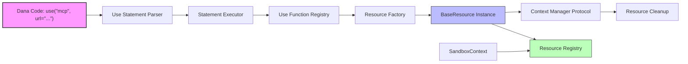

| [← User-defined Resources](./user_defined_resources.md) | [Capability Invocation →](./capability_invocation.md) |
|---|---|

# Design Document: Dana Use Statement for Resource Acquisition

```text
Author: Lam Nguyen
Version: 0.5
Date: 2025-06-08
Status: Implementation Phase
```

## Problem Statement

Dana programs need a declarative mechanism to acquire and manage external resources during execution. Currently, developers must manually handle:
- Connection establishment to external services (MCP servers, APIs, databases)
- Resource lifecycle management and cleanup
- Type-safe configuration and error handling
- Integration with Dana's execution model and reasoning capabilities

The lack of a standardized resource acquisition pattern creates barriers to building robust Dana applications that interact with external systems. Without proper resource management, applications suffer from resource leaks, inconsistent error handling, and security vulnerabilities. Dana needs a unified approach that provides:
- Clean separation between resource configuration and usage
- Automatic lifecycle management with proper cleanup
- Type-safe integration with Dana's execution model
- Security boundaries and access control

## Goals

- Provide a simple, declarative syntax for resource acquisition: `use("resource_type", ...config)`
- Enable dynamic resource configuration through positional and keyword arguments  
- Support both standalone resource creation and context manager patterns with `with` statements
- Integrate seamlessly with Dana's `reason()` function for AI-enhanced capabilities
- Provide automatic resource cleanup and lifecycle management
- Support extensible resource types through a plugin architecture
- Maintain type safety with proper error handling and validation
- Enable scoped resource management with automatic cleanup

## Non-Goals

- We will not provide a general-purpose import system (that's handled by modules)
- We will not support runtime modification of resource configurations after creation
- We will not cache resource instances across different execution contexts
- We will not provide complex resource dependency resolution or orchestration
- We will not support nested or hierarchical resource acquisition in a single statement

## Proposed Solution

The `use` statement provides a unified interface for resource acquisition that:

1. **Declarative Syntax**: Simple function-call syntax that's intuitive and readable
2. **Flexible Arguments**: Support for both positional and keyword arguments with expression evaluation
3. **Context Manager Integration**: Seamless integration with `with` statements for scoped resource management
4. **Extensible Architecture**: Plugin-based system for adding new resource types
5. **Lifecycle Management**: Automatic resource registration and cleanup

### Architecture Overview



## Proposed Design

### 1. Grammar and Syntax

**Grammar Definition:**
```lark
use_stmt: USE "(" [mixed_arguments] ")"
mixed_arguments: with_arg ("," with_arg)*
with_arg: kw_arg | expr
kw_arg: NAME "=" expr
```

**Syntax Patterns:**
```dana
# Basic resource acquisition
use("mcp")

# With configuration
use("mcp", url="http://localhost:8880")

# Mixed arguments
use("mcp", "websearch", url="http://localhost:8880", timeout=30)

# With assignment
client = use("mcp", url="http://localhost:8880")

# Context manager pattern
with use("mcp", url="http://localhost:8880") as client:
    # scoped usage
```

### 2. AST Representation

```python
@dataclass
class UseStatement:
    args: list[Expression]              # Positional arguments
    kwargs: dict[str, Expression]       # Keyword arguments  
    target: Identifier | None = None    # Assignment target
    location: Location | None = None    # Source location
```

### 3. Resource Architecture

**Base Resource Interface:**
```python
class BaseResource:
    def __init__(self, name: str, *args, **kwargs):
        self.name = name
        self.status = "initialized"
    
    def __enter__(self):
        """Context manager entry"""
        self.setup()
        return self
    
    def __exit__(self, exc_type, exc_val, exc_tb):
        """Context manager exit with cleanup"""
        self.teardown()
    
    def setup(self):
        """Resource initialization"""
        pass
    
    def teardown(self):
        """Resource cleanup"""
        pass
```

### 4. Resource Types

**MCP Resource (Primary Implementation):**
```python
class MCPResource(BaseResource):
    def __init__(self, name: str, url: str, transport: str = "http", **kwargs):
        super().__init__(name)
        self.url = url
        self.transport = transport
        self.client = None
    
    def setup(self):
        """Establish MCP connection"""
        self.client = create_mcp_client(self.url, self.transport)
        self.status = "connected"
    
    def list_tools(self) -> list:
        """List available MCP tools"""
        return self.client.list_tools()
    
    def call_tool(self, name: str, **kwargs):
        """Call an MCP tool"""
        return self.client.call_tool(name, **kwargs)
```

### 5. Function Registry Integration

**Use Function Implementation:**
```python
def use_function(context: SandboxContext, function_name: str, *args, _name: str | None = None, **kwargs) -> BaseResource:
    """Core use function implementation"""
    
    # Generate unique resource name if not provided
    if _name is None:
        _name = generate_resource_name()
    
    # Route to appropriate resource factory
    if function_name.lower() == "mcp":
        resource = MCPResource(name=_name, *args, **kwargs)
    else:
        raise NotImplementedError(f"Resource type {function_name} not implemented")
    
    # Register resource with context
    context.set_resource(_name, resource)
    
    return resource
```

### 6. Integration with With Statements

The `use` statement seamlessly integrates with `with` statements through shared argument parsing:

```dana
# Direct usage
client = use("mcp", url="http://localhost:8880")
tools = client.list_tools()

# Context manager usage
with use("mcp", url="http://localhost:8880") as client:
    tools = client.list_tools()
    result = client.call_tool("search", query="Dana language")
# Automatic cleanup happens here
```

### 7. Error Handling

**Error Types:**
```python
class UseStatementError(Exception):
    """Base class for use statement errors"""
    pass

class ResourceTypeError(UseStatementError):
    """Unknown or unsupported resource type"""
    pass

class ResourceConfigurationError(UseStatementError):
    """Invalid resource configuration"""
    pass

class ResourceConnectionError(UseStatementError):
    """Failed to connect to resource"""
    pass
```

**Error Handling Flow:**
1. **Syntax Errors**: Caught during parsing (positional args after keyword args)
2. **Type Errors**: Caught during function resolution (unknown resource types)
3. **Configuration Errors**: Caught during resource instantiation
4. **Runtime Errors**: Caught during resource operations

## Proposed Implementation

### 1. Parser Integration

**Statement Transformer (`statement_transformer.py`):**
```python
def use_stmt(self, items):
    """Transform use statement parse tree to AST"""
    
    # Extract arguments
    args = []
    kwargs = {}
    
    # Process mixed_arguments if present
    if len(items) > 1 and items[1] is not None:
        # Handle argument parsing with validation
        for arg in argument_items:
            if is_keyword_arg(arg):
                key, value = extract_keyword_arg(arg)
                kwargs[key] = value
            else:
                if kwargs:  # Positional after keyword
                    raise SyntaxError("Positional argument follows keyword argument")
                args.append(extract_positional_arg(arg))
    
    return UseStatement(args=args, kwargs=kwargs)
```

### 2. Execution Integration

**Statement Executor (`statement_executor.py`):**
```python
def execute_use_statement(self, stmt: UseStatement) -> BaseResource:
    """Execute use statement by calling use function"""
    
    # Evaluate arguments in current context
    eval_args = [self.evaluate_expression(arg) for arg in stmt.args]
    eval_kwargs = {k: self.evaluate_expression(v) for k, v in stmt.kwargs.items()}
    
    # Call use function through registry
    use_func = self.context.function_registry.resolve("use")
    return use_func(self.context, *eval_args, **eval_kwargs)
```

### 3. Resource Management

**Context Integration:**
```python
class SandboxContext:
    def __init__(self):
        self.resources: dict[str, BaseResource] = {}
    
    def set_resource(self, name: str, resource: BaseResource):
        """Register a resource"""
        self.resources[name] = resource
    
    def get_resource(self, name: str) -> BaseResource | None:
        """Retrieve a resource"""
        return self.resources.get(name)
    
    def cleanup_resources(self):
        """Cleanup all resources"""
        for resource in self.resources.values():
            try:
                resource.teardown()
            except Exception as e:
                logger.warning(f"Error cleaning up resource {resource.name}: {e}")
```

### 4. Type System Integration

**Type Checking:**
```python
def validate_use_statement(stmt: UseStatement):
    """Validate use statement types"""
    
    # Ensure first argument is string (resource type)
    if not stmt.args or not isinstance(stmt.args[0], StringLiteral):
        raise TypeError("First argument to use() must be a string resource type")
    
    # Validate argument types
    for arg in stmt.args[1:]:
        validate_expression_type(arg)
    
    for value in stmt.kwargs.values():
        validate_expression_type(value)
```

### 5. Security Considerations

**Resource Access Control:**
```python
class ResourceSecurityManager:
    def __init__(self):
        self.allowed_resource_types = {"mcp"}  # Configurable whitelist
        self.connection_limits = {"mcp": 10}    # Per-type limits
    
    def validate_resource_request(self, resource_type: str, config: dict):
        """Validate resource access permissions"""
        
        if resource_type not in self.allowed_resource_types:
            raise SecurityError(f"Resource type {resource_type} not allowed")
        
        # Validate connection limits
        current_count = count_active_resources(resource_type)
        if current_count >= self.connection_limits.get(resource_type, 5):
            raise SecurityError(f"Too many {resource_type} connections")
```

## Design Review Checklist

- [x] Security review completed - Resource access controls and connection limits
- [x] Performance impact assessed - Minimal overhead, lazy resource creation
- [x] Error handling comprehensive - Multiple error types with clear messages
- [x] Testing strategy defined - Unit tests for parser, executor, and resources
- [x] Documentation planned - Comprehensive syntax and usage examples
- [x] Scalability considered - Plugin architecture for new resource types
- [x] Maintenance overhead evaluated - Clean separation of concerns
- [x] Backwards compatibility checked - New feature, no breaking changes
- [x] Dependencies identified - MCP client libraries, transport protocols
- [x] Resource requirements estimated - Memory per resource, connection pools

## Implementation Phases

### Phase 1: Core Infrastructure ✓
- [x] Grammar definition and parser integration
- [x] AST representation and transformer
- [x] Basic statement executor integration
- [x] Function registry integration
- [x] Error handling framework

### Phase 2: MCP Resource Implementation ✓
- [x] BaseResource abstract class
- [x] MCPResource concrete implementation
- [x] HTTP and SSE transport support
- [x] Context manager protocol
- [x] Resource lifecycle management

### Phase 3: Integration and Testing ✓
- [x] With statement integration
- [x] SandboxContext resource management
- [x] Comprehensive test suite
- [x] Error handling validation
- [x] Type checking integration

### Phase 4: Advanced Features (In Progress)
- [ ] Additional resource types (database, filesystem, etc.)
- [ ] Resource discovery and configuration
- [ ] Advanced error recovery
- [ ] Performance monitoring and metrics
- [ ] Resource caching strategies

## Usage Examples

### 1. Basic MCP Integration
```dana
# Simple MCP connection
websearch = use("mcp", url="http://localhost:8880/websearch")
tools = websearch.list_tools()
result = websearch.call_tool("search", query="Dana language")
```

### 2. Context Manager Pattern
```dana
# Scoped resource usage with automatic cleanup
with use("mcp", url="https://demo.mcp.aitomatic.com/sensors") as sensors:
    sensor_list = sensors.list_tools()
    data = sensors.call_tool("read_sensor", id="temp_01")
    print(f"Temperature: {data.value}")
# sensors automatically cleaned up here
```

### 3. Integration with Reasoning
```dana
# Enhanced reasoning with external tools
with use("mcp", url="http://localhost:8880/websearch") as search:
    answer = reason("Who is the CEO of Aitomatic", {"enable_poet": True})
    print(answer)
```

### 4. Variable Configuration
```dana
# Dynamic configuration
server_url = "http://localhost:8880"
service_name = "analytics"

analytics = use("mcp", url=f"{server_url}/{service_name}", timeout=60)
results = analytics.call_tool("analyze", data=dataset)
```

## Future Extensions

### 1. Additional Resource Types
```dana
# Database connections
db = use("database", url="postgresql://localhost/mydb", pool_size=10)

# File systems
fs = use("filesystem", path="/data", mode="read")

# Message queues
queue = use("queue", broker="redis://localhost", topic="events")
```

### 2. Resource Configuration Profiles
```dana
# Named configuration profiles
api_client = use("http", profile="production")
dev_client = use("http", profile="development")
```

### 3. Resource Dependencies
```dana
# Automatic dependency resolution
ml_pipeline = use("pipeline", 
    database="postgres://localhost/ml",
    storage="s3://bucket/models",
    compute="kubernetes://cluster"
)
```

The `use` statement provides a powerful, extensible foundation for resource management in Dana while maintaining simplicity, security, and proper lifecycle management.